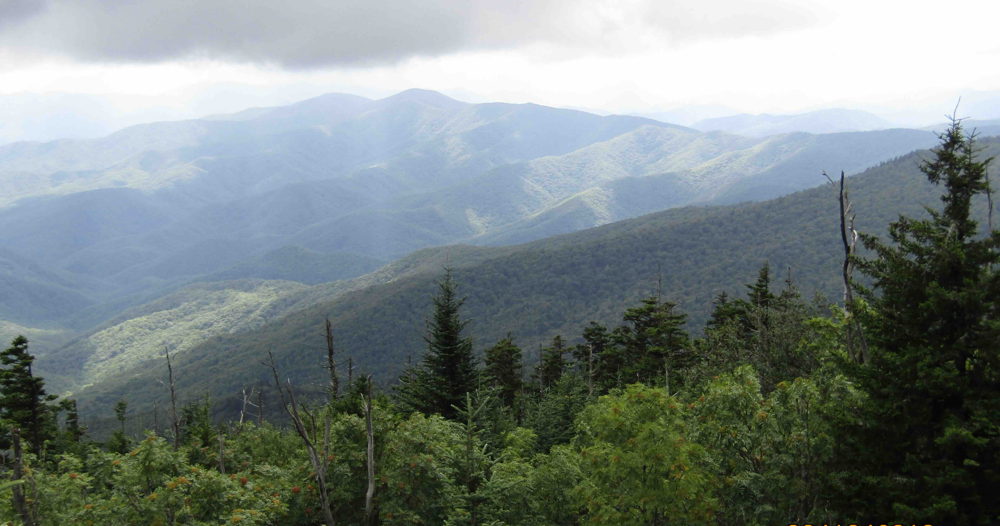
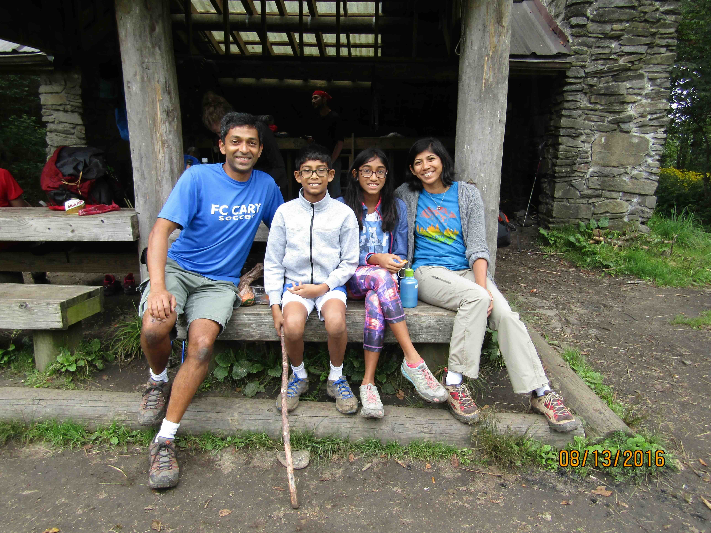
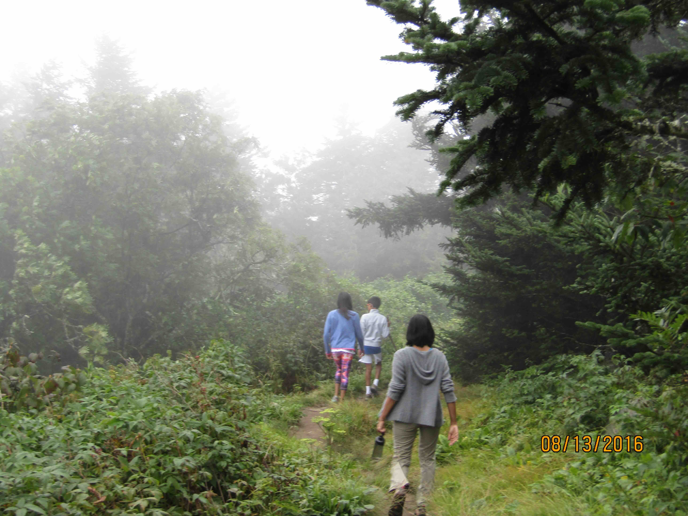
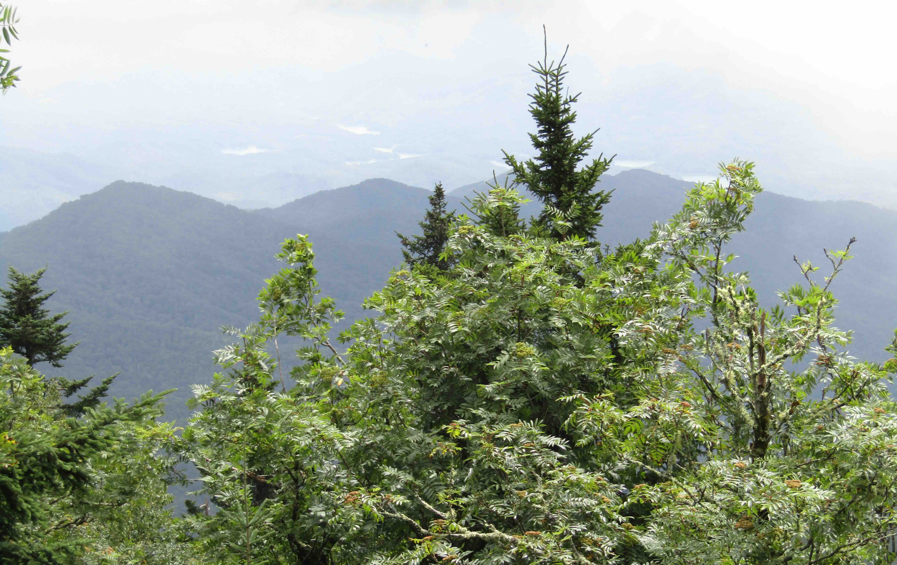

+++
date = '2016-08-13T00:00:00-04:00'
draft = false
title = 'Appalachian Trail, Double Spring Gap'
coords = [35.565170, -83.542900]
+++

### Appalachian Trail to Double Spring Gap Shelter

* 6.6 mi
* 1614' elevation gain
* 4 hours

### View from the AT

### At the shelter

### On the AT

### Another view from the AT

[AllTrails - Double Spring Gap via the Appalachian Trail](https://www.alltrails.com/trail/us/north-carolina/double-spring-gap-shelter-and-clingmans-dome-via-appalachian-trail)
