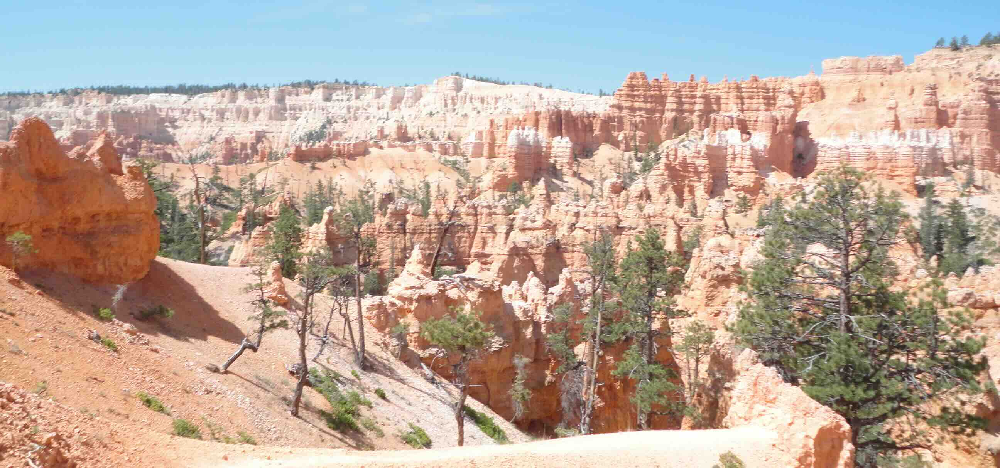
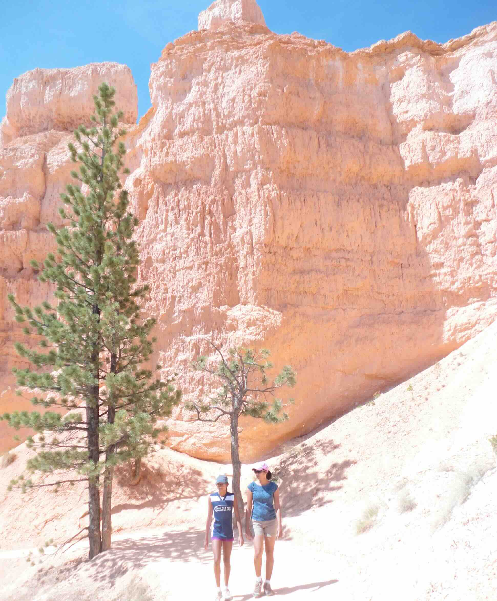
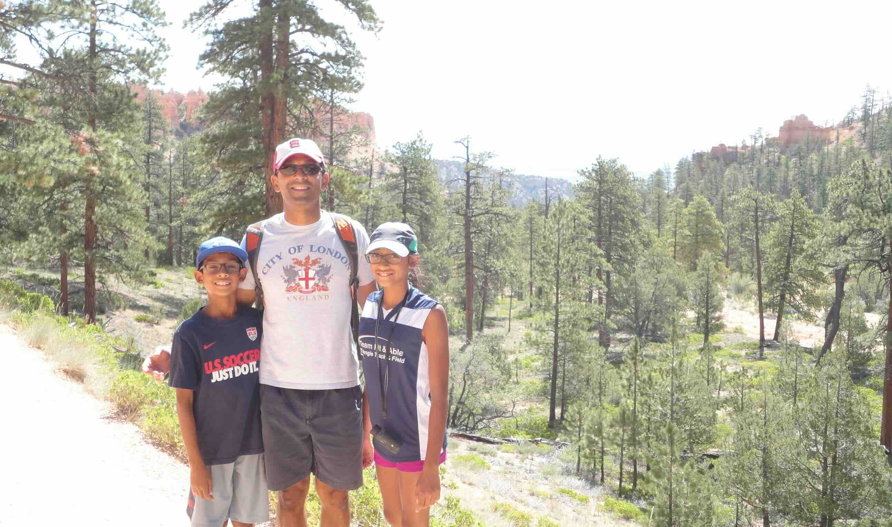
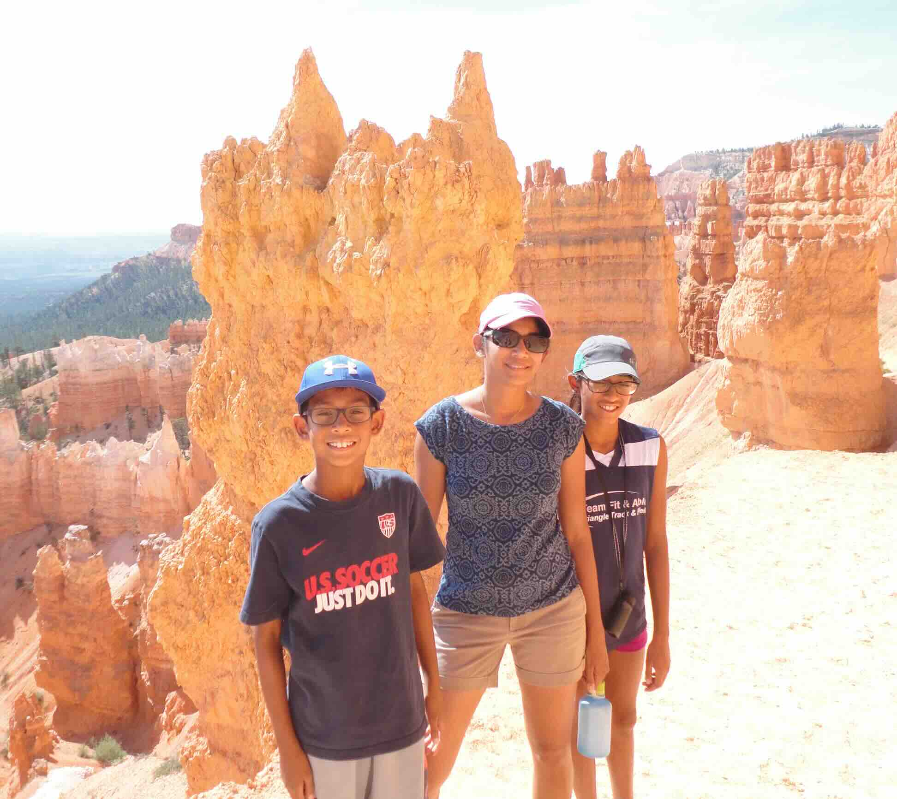
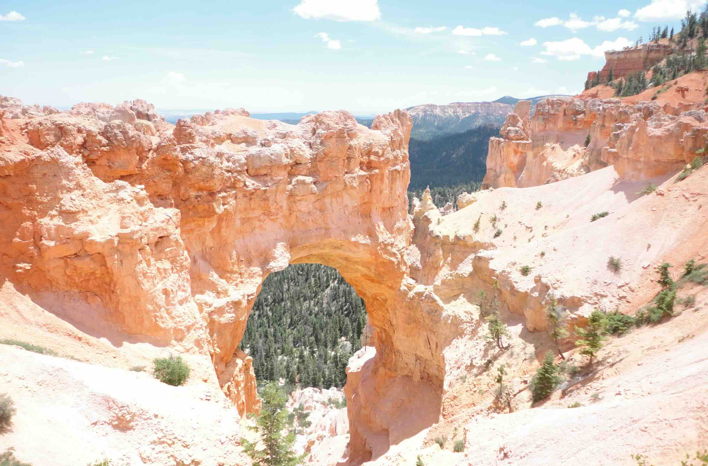

+++
date = '2015-06-30T00:00:00-04:00'
draft = false
title = 'Bryce Canyon'
coords = [37.618697, -112.160539]
+++

### Bryce Canyon; Queens Garden Trail

* 3 mi
* 646' elevation gain
* 2 hours

### Bryce Canyon National Park

### On the Queens Garden Loop

### Arch

[AllTrails - Navajo Loop & Queens Garden Trail](https://www.alltrails.com/trail/us/utah/navajo-loop-and-queens-garden-trail)
