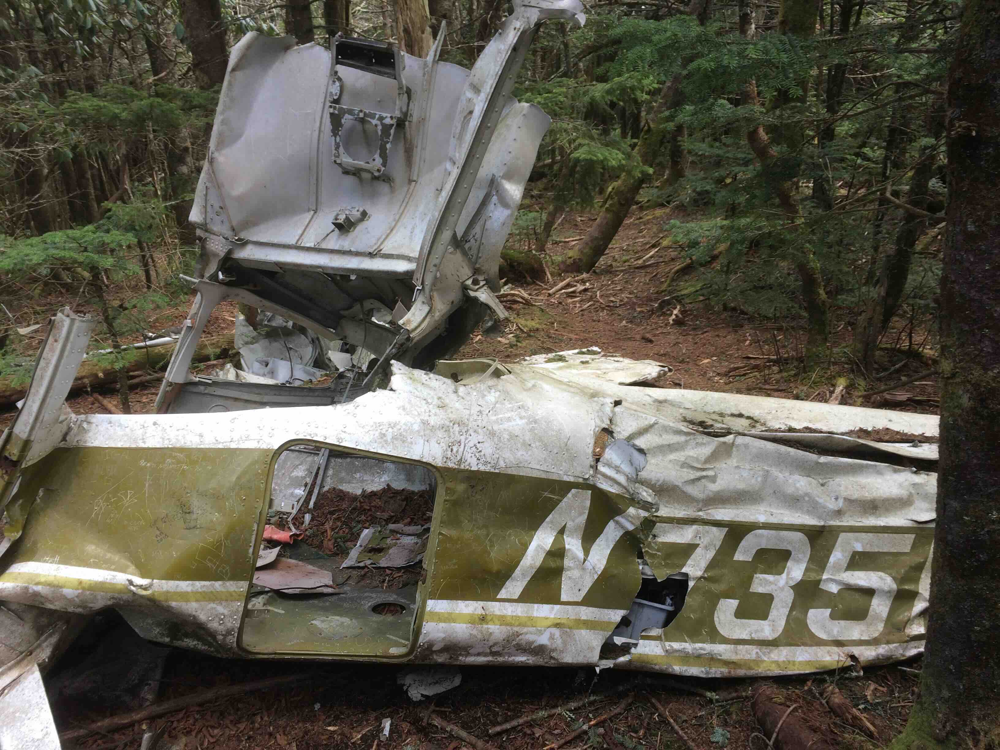
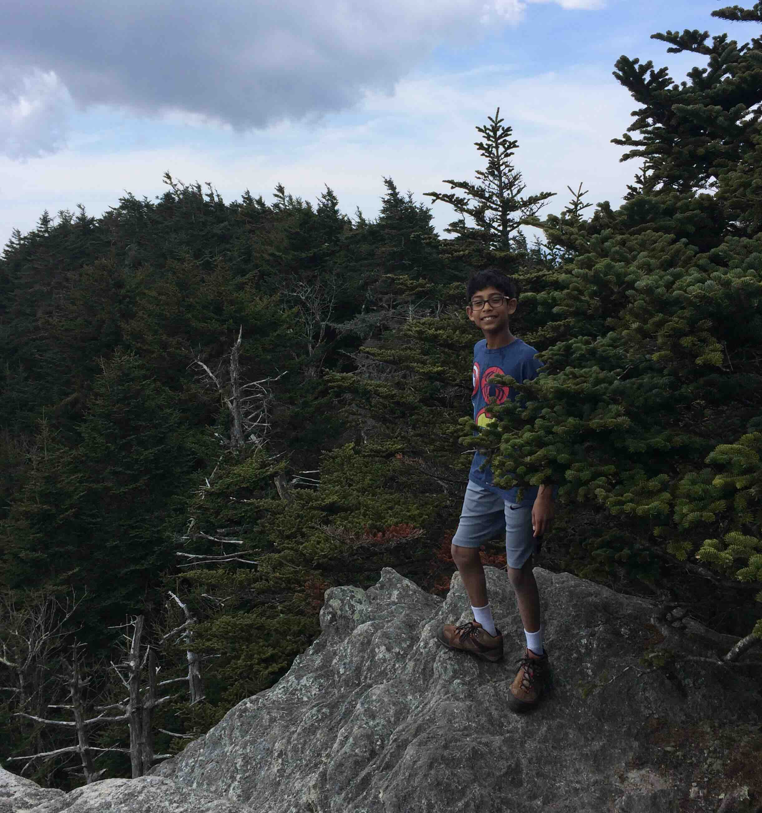
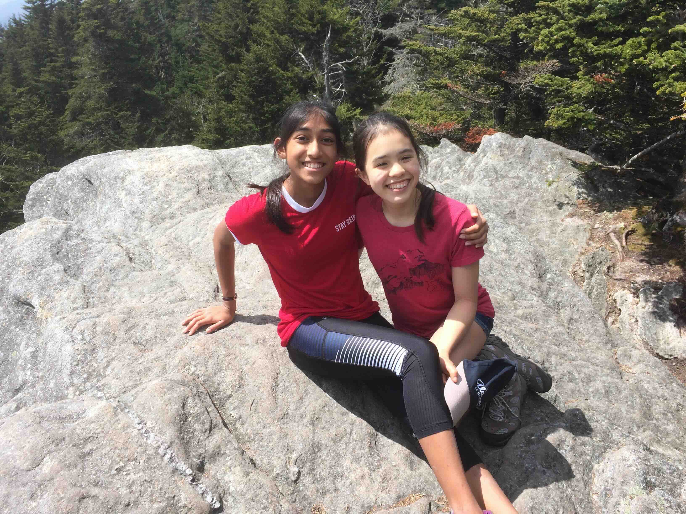
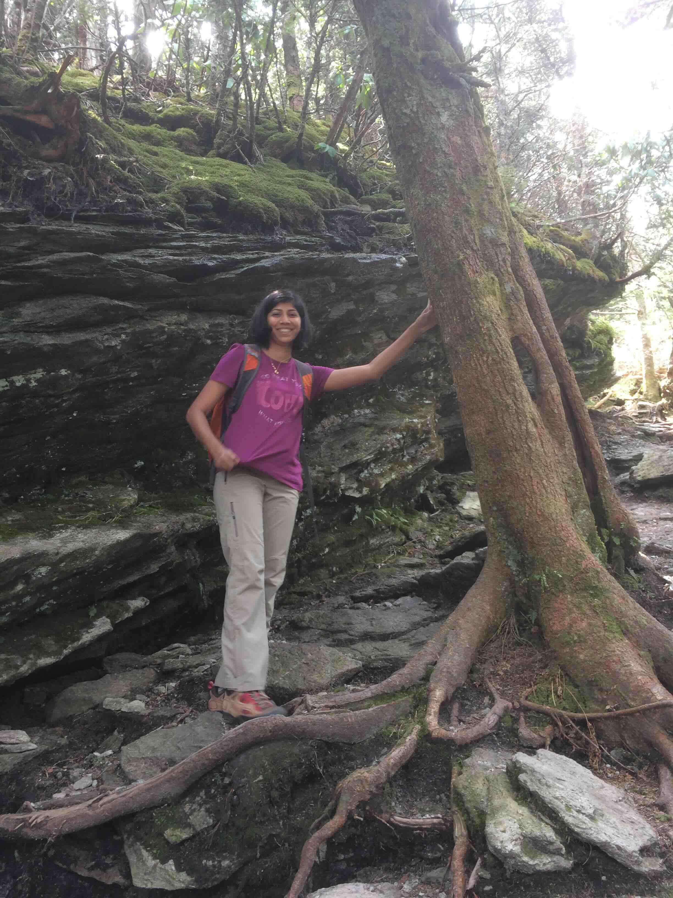

+++
date = '2017-04-14T00:00:00-04:00'
draft = false
title = 'Calloway Peak from the Parkway'
coords = [36.111533, -81.810286]
+++

### Calloway Park via the Daniel Boone Scout Trail 

* 7.2 mi
* 2011' elevation gain
* 5 hours

### Site of the [crash](https://www.greatamericanhikes.com/post/hike-to-grandfather-mountain-s-cessna-182q-skylane-n735mb-crash-site)

### Near the peak

### Hiking with friends

### On the way up

[AllTrails - Daniel Boone Scout Trail to Calloway Peak](https://www.alltrails.com/trail/us/north-carolina/daniel-boone-scout-trail-to-calloway-peak)
