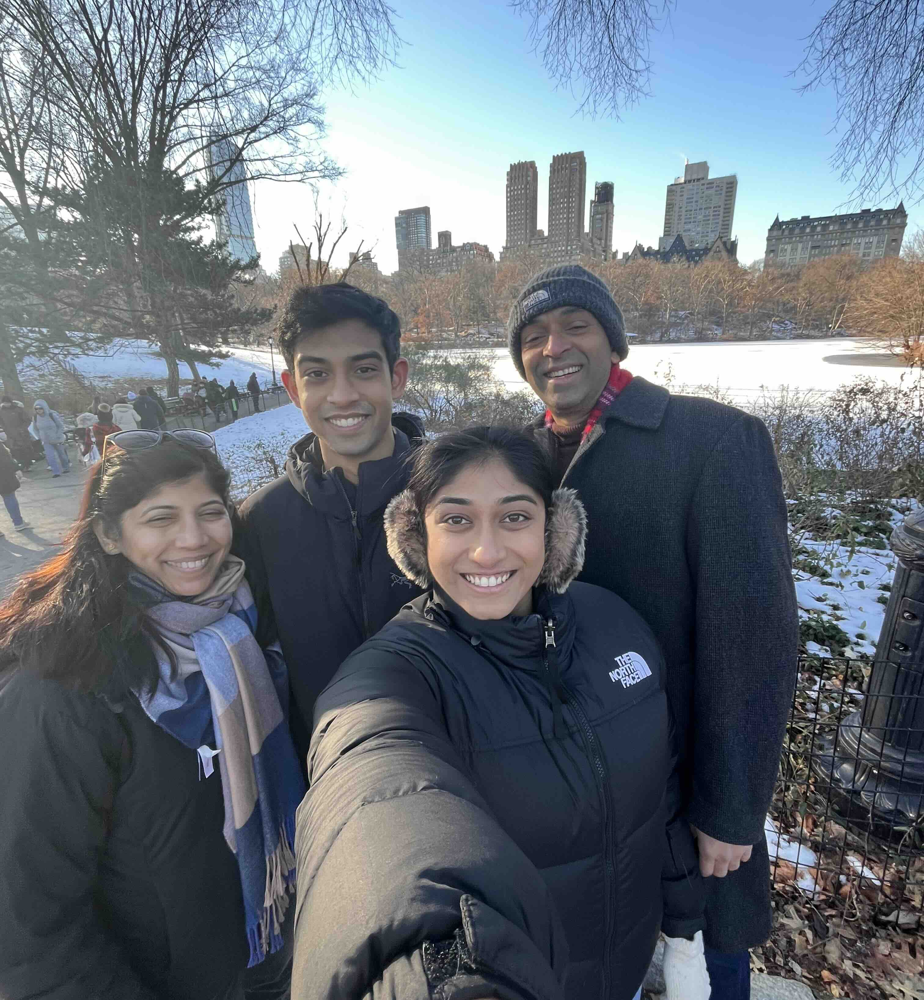
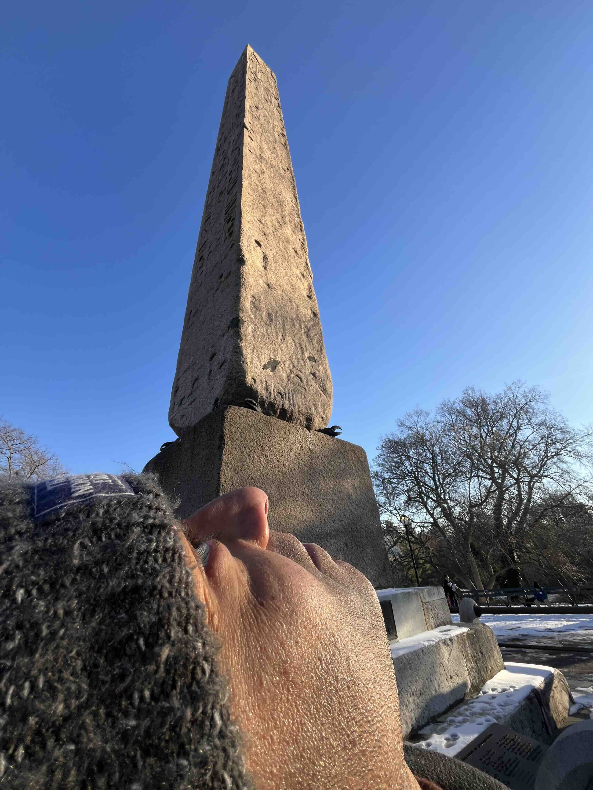

+++
date = '2024-12-29T00:00:00-04:00'
draft = false
title = 'Central Park'
coords = [40.775528, -73.971611]
+++

### Central Park ramble

* 1.5 mi
* 100' elevation gain
* 1 hours

### At the Bow Bridge

### Two obelisks

[AllTrails - Central Park East section](https://www.alltrails.com/trail/us/new-york/central-park-east-and-west-drive-loop)
