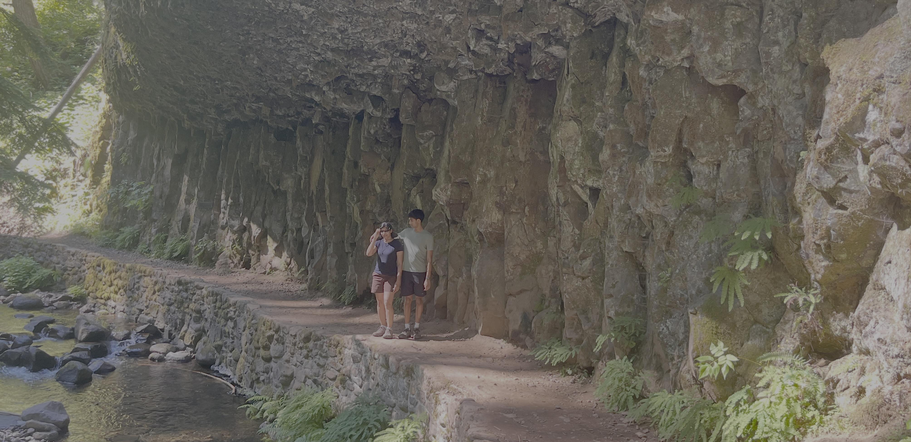

+++
date = '2025-06-29T00:00:00-04:00'
draft = false
title = 'Columbia River Gorge'
coords = [45.576855, -122.116081]
+++

## Multnomah and Wahkeena Falls Loop

* 5 mi
* 1600' elevation gain
* 3 hours

### From the base of the Multnomah Falls

### Rocky overhang along the Larch Mountain Trail

### On the trail down to Wahkeena Falls

https://www.alltrails.com/trail/us/oregon/wahkeena-falls-loop-trail
