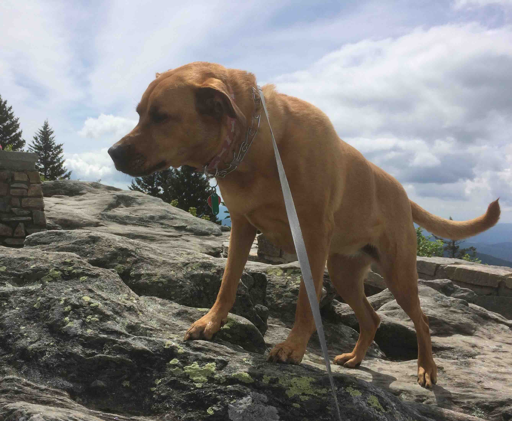
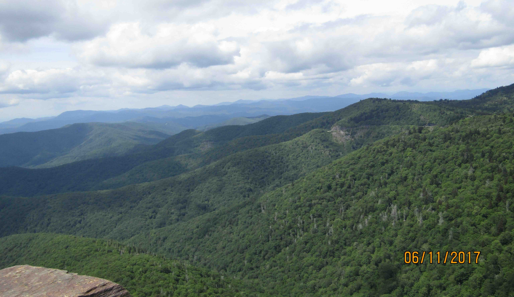
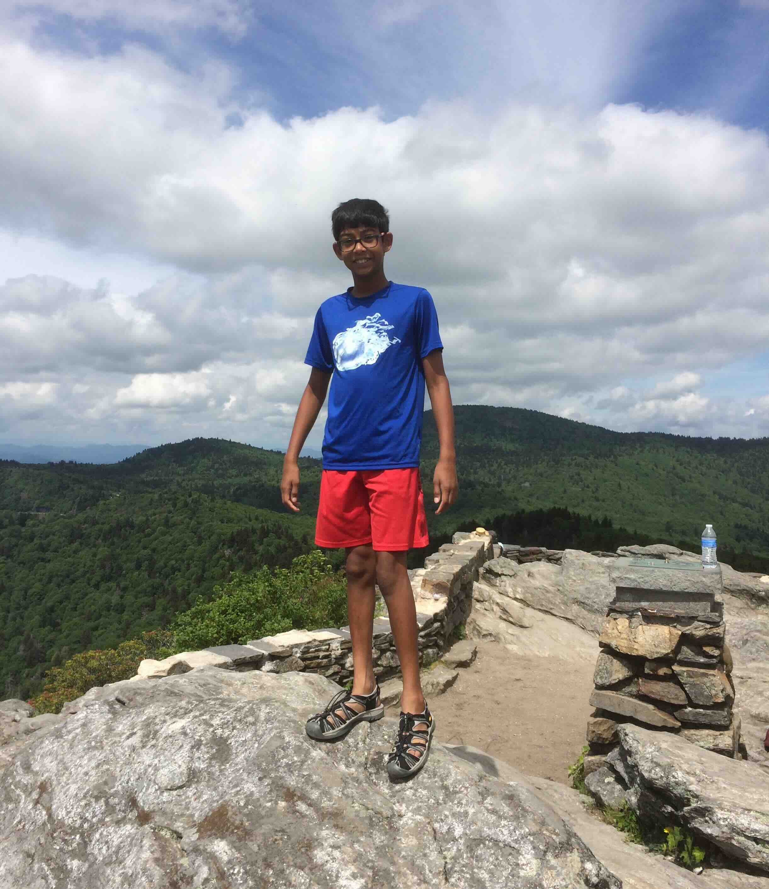
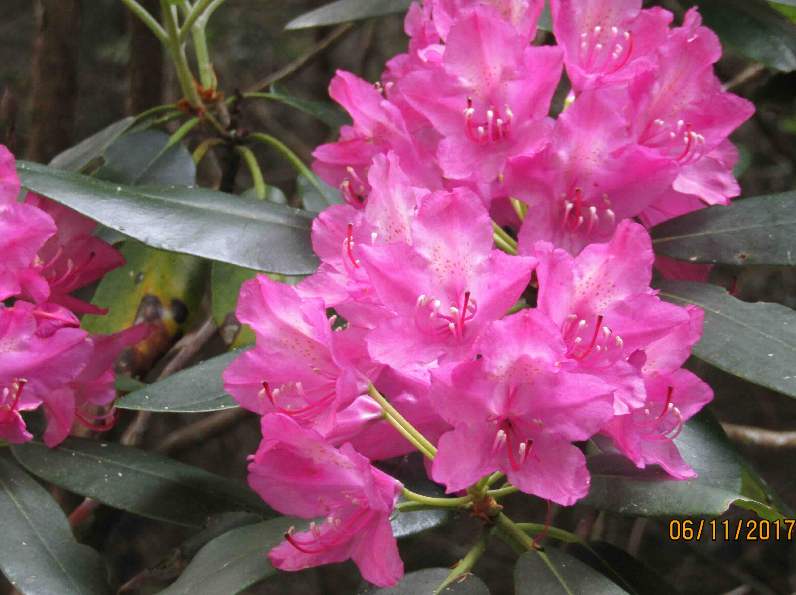
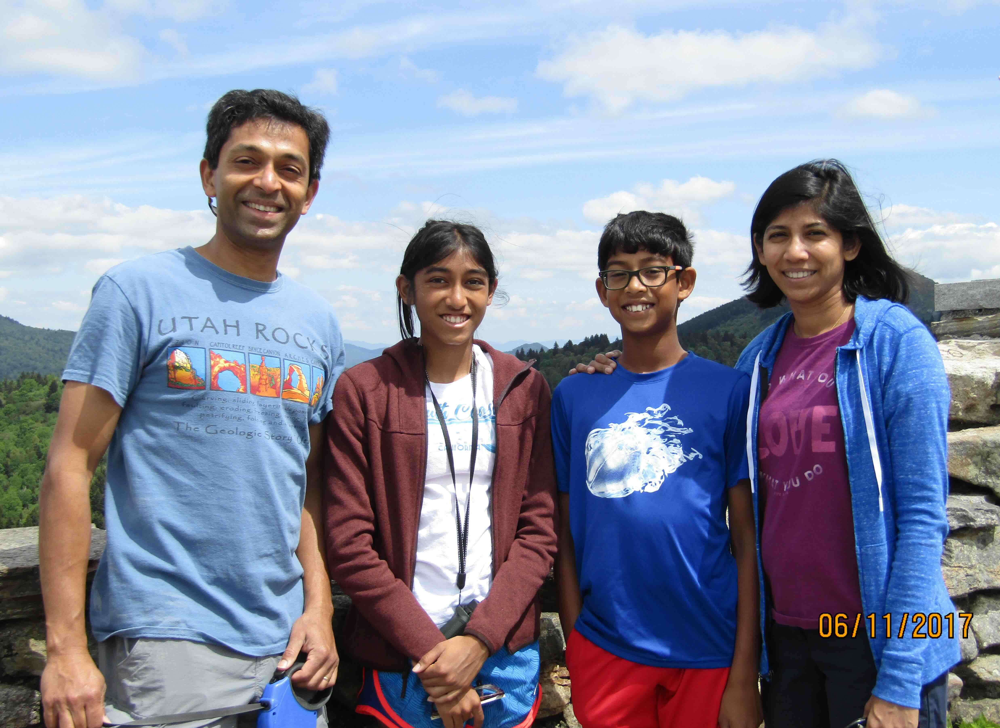

+++
date = '2017-06-11T00:00:00-04:00'
draft = false
title = 'Devils Courthouse'
coords = [35.302697, -82.895950]
+++

### Devil's Courthouse Trail

* 0.9 mi
* 282' elevation gain
* 0.75 hours

### Summit panorama

### Bella at the top

### View of the Blue Ridge Parkway and Mountains

### 360° view

### Pink rhododendron

### Family picture

[AllTrails - Devil's Courthouse Trail]( https://www.alltrails.com/trail/us/north-carolina/devils-courthouse-trail)
