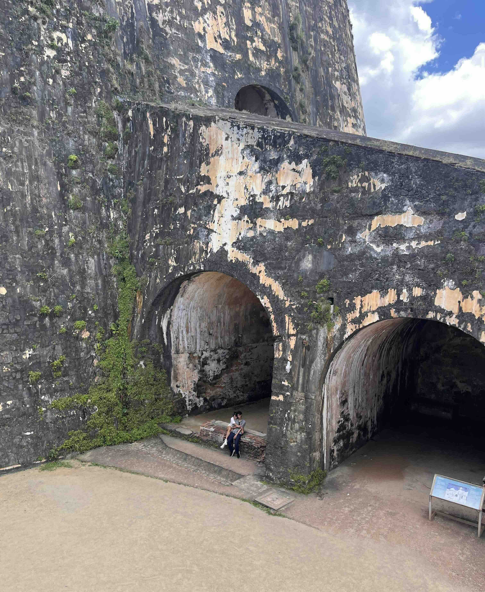

+++
date = '2026-05-03T00:00:00-04:00'
draft = false
title = 'Castillo San Felipe del Morro'
coords = [18.470250, -66.124397]
+++

### Castillo San Felipe del Morro

* 1 mi
* 0' elevation gain
* 2 hours

### Panorama from El Morro

### Entrance

### At a fort balcony

### Walls of the fort

[Castillo San Felipe del Morro](https://www.nps.gov/saju/learn/historyculture/el-morro.htm)
