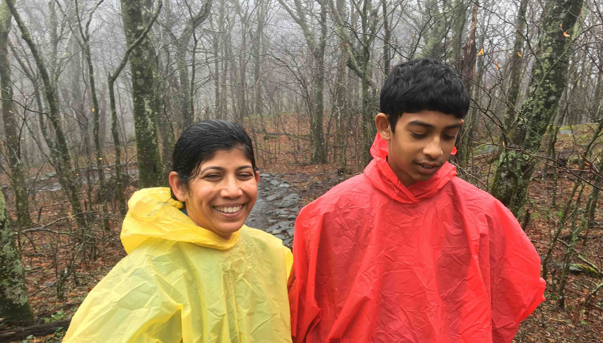
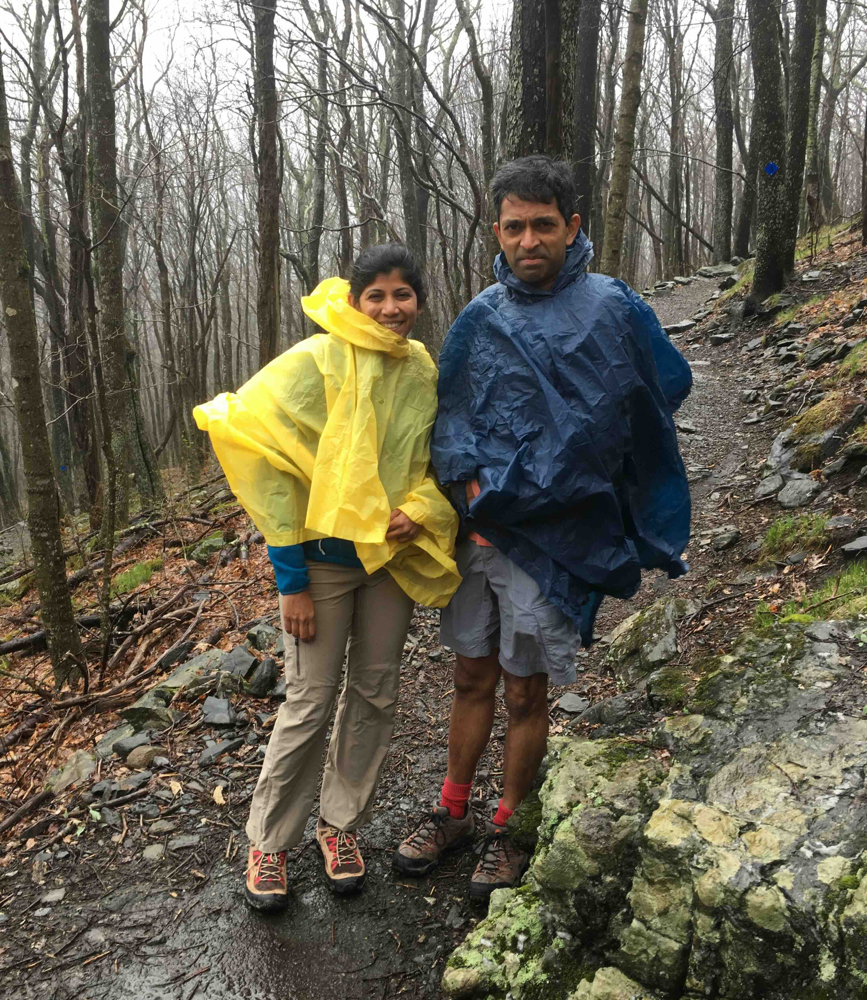

+++
date = '2019-04-19T00:00:00-04:00'
draft = false
title = 'Elk Knob State Park'
coords = [36.330203, -81.680030]
+++

### Elk Knob Trail

* 3.9 mi
* 977' elevation gain
* 2 hours

### April showers ...

### Fun!

[AllTrails - Elk Knob Summit Trail](https://www.alltrails.com/trail/us/north-carolina/elk-knob-summit-trail)
