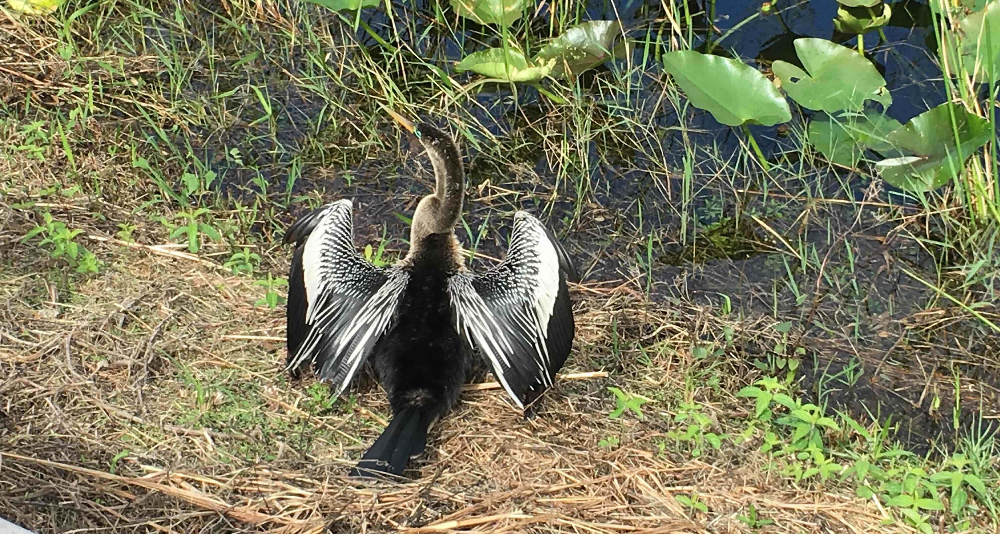
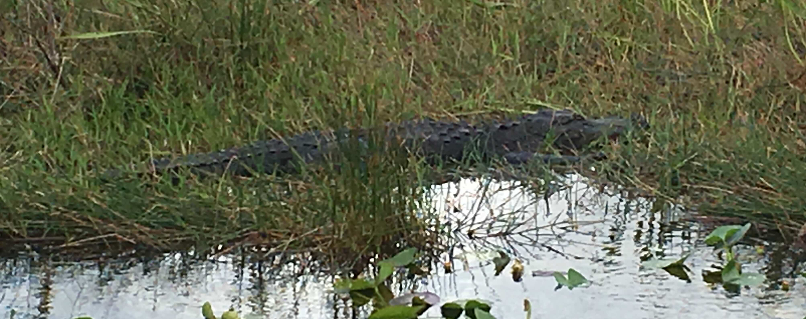
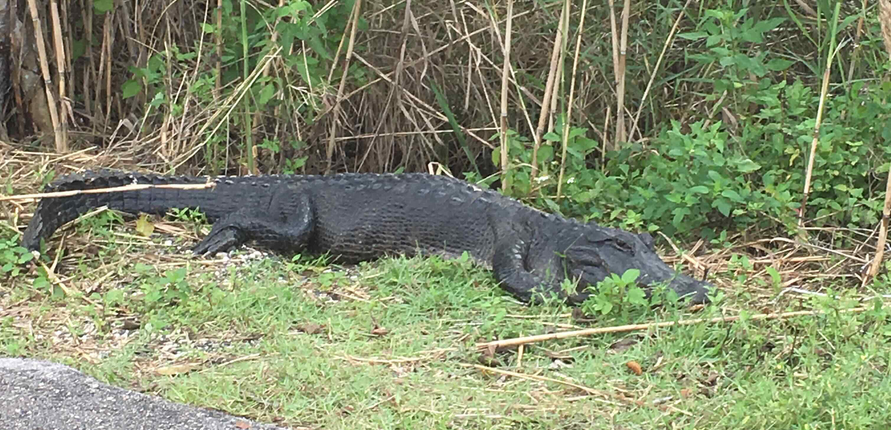

+++
date = '2019-12-27T00:00:00-04:00'
draft = false
title = 'Everglades'
coords = [25.382055, -80.607795]
+++

### Anhinga Trail

* 0.8 mi
* 0' elevation gain
* 1 hour

### The trails namesake

### American Alligator

### Near the trail

### Trailhead

[AllTrails - Anhinga Trail](https://www.alltrails.com/trail/us/florida/anhinga-trail)
