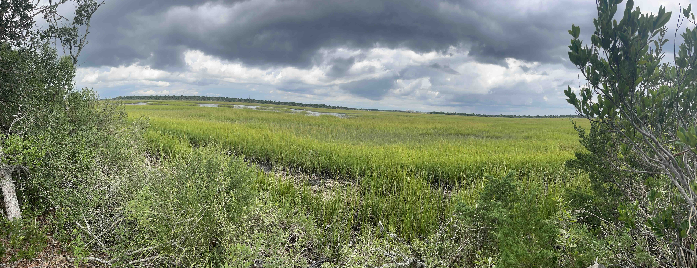
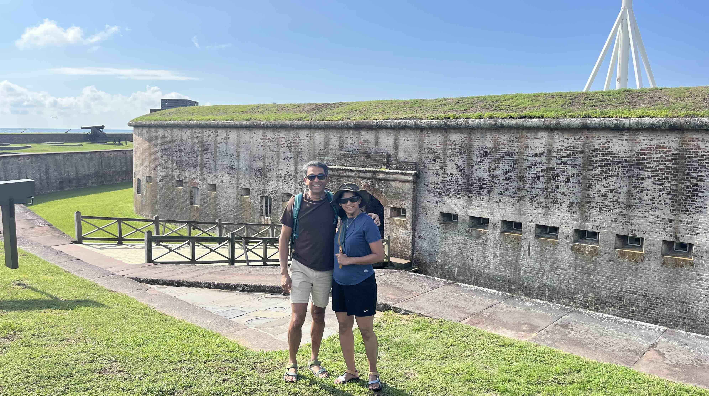
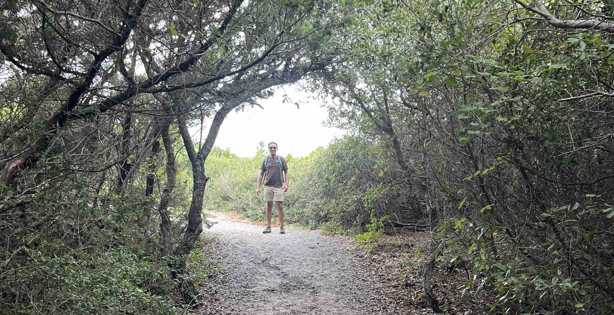

+++
date = '2026-09-06T00:00:00-04:00'
draft = false
title = 'Fort Macon'
coords = [34.694589, -76.682044]
+++

### Fort Macon State Park

* 3.3 mi
* 32' elevation gain
* 1.5 hours

### Elliot Coues Trail Ocean Panorama

### Elliot Coues Sound Panorama

### Fort Macon

### Maritime Forest Canopy

[AllTrails - Elliot Coues Trail](https://www.alltrails.com/trail/us/north-carolina/elliot-coues-trail)
