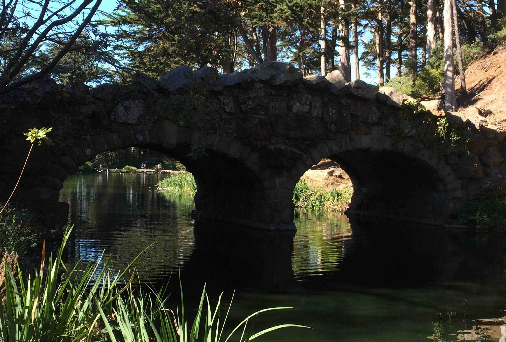
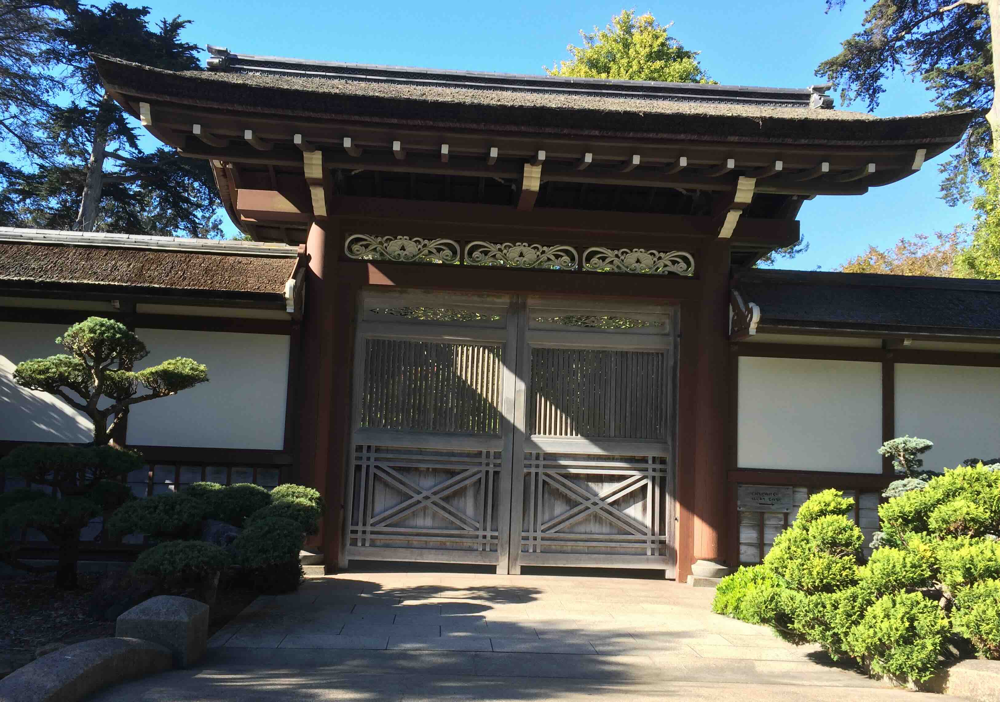

+++
date = '2015-10-30T00:00:00-04:00'
draft = false
title = 'Golden Gate Park'
coords = [37.769811, -122.469789]
+++

### Golden Gate Park

* 2.3 mi
* 160' elevation gain
* 1 hour

### Blue Heron Lake Bridge

### Japanese Tea Garden

[AllTrails - Blue Heron Lake](https://www.alltrails.com/trail/us/california/stow-lake-and-strawberry-hill-loop)
