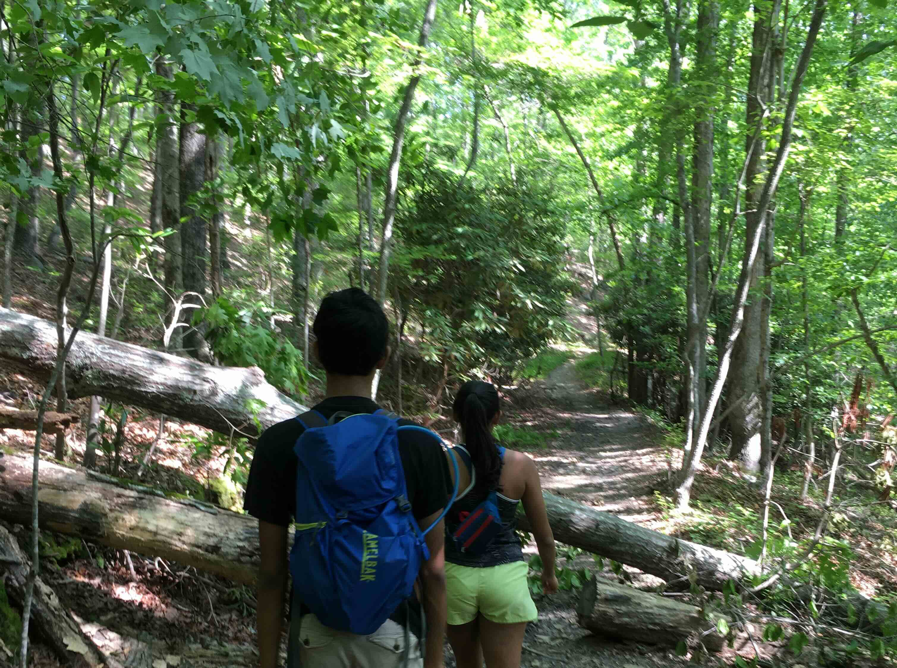
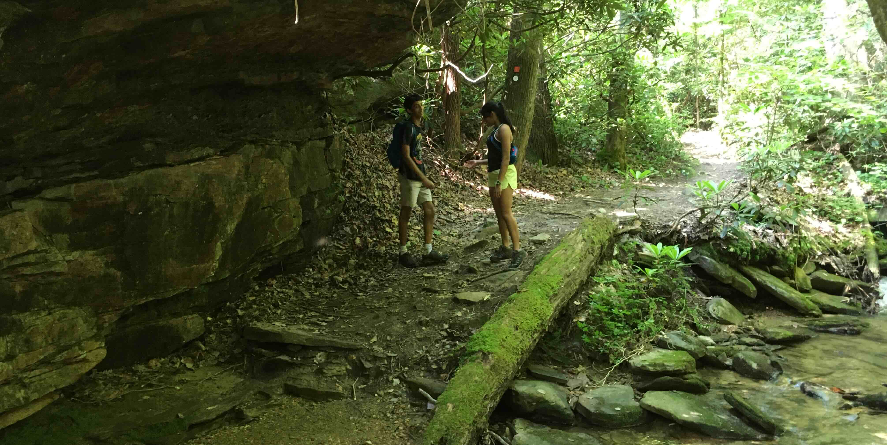
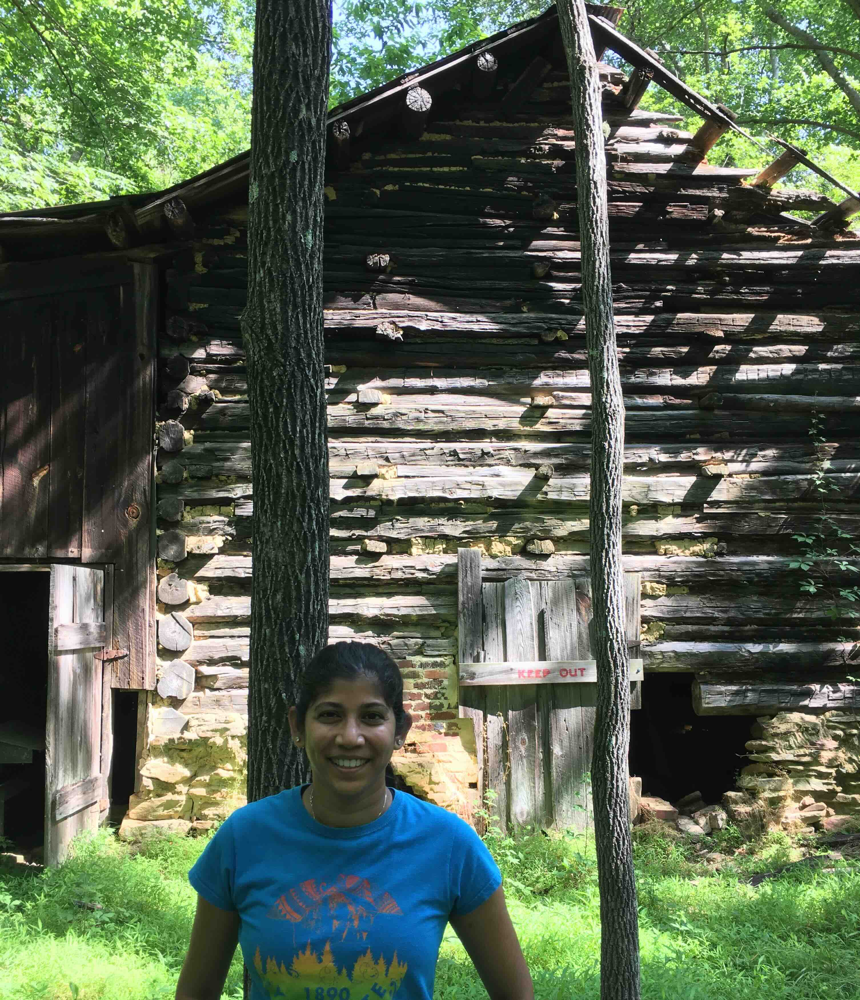

+++
date = '2020-06-06T00:00:00-04:00'
draft = false
title = 'Indian Creek Trail at Hanging Rock State Park'
coords = [36.403645, -80.259330]
+++

### Indian Creek Trail at Hanging Rock State Park

* 7.3 mi
* 1213' elevation gain
* 3.5 hours

### Starting out

### Rock Overhang

### Cabin on the trail

### Creek crossing

[AllTrails - Indian Creek Trail](https://www.alltrails.com/trail/us/north-carolina/indian-creek-trail)
