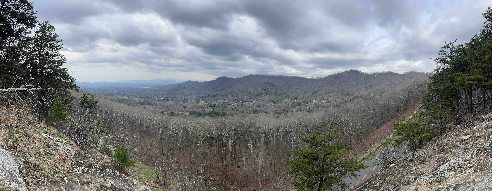
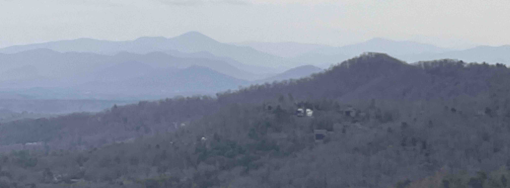
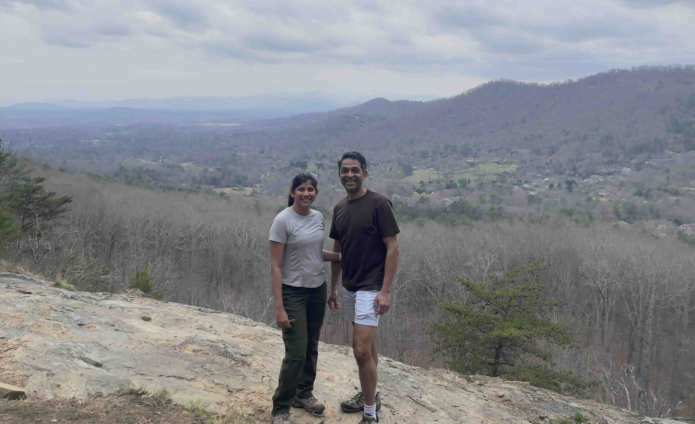
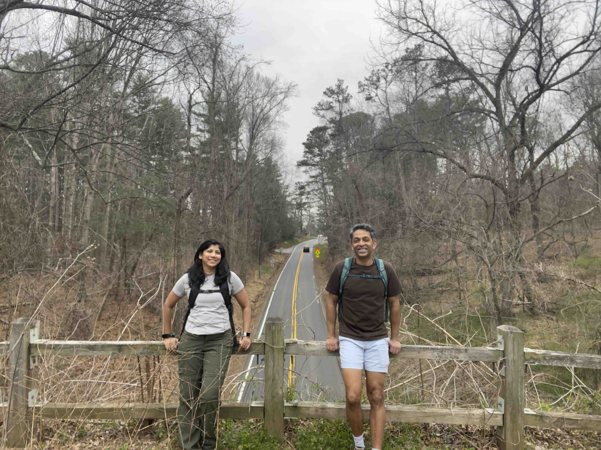

+++
date = '2026-03-21T00:00:00-04:00'
draft = false
title = 'Haw Creek Overlook'
coords = [35.617408, -82.491433]
+++

### Haw Creek Overlook

* 4.8 mi
* 816' elevation gain
* 2 hours

### Panorama from the overlook

### The Blue Ridge Mountains in the distance 

### At the Haw Creek Overlook

### Starting at the Folk Art Center

[AllTrails - Folk Art to Haw Creek Overlook](https://www.alltrails.com/trail/us/north-carolina/mountains-to-sea-trail-folk-art-center-to-haw-creek-overlook)
