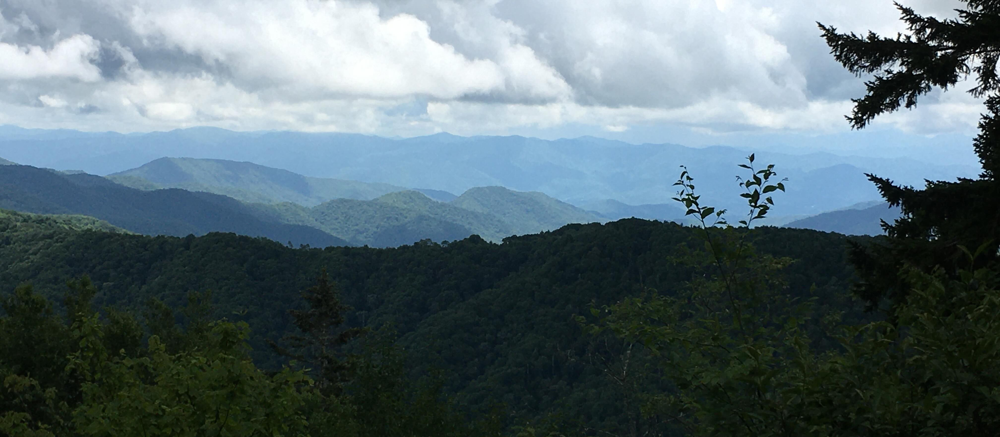
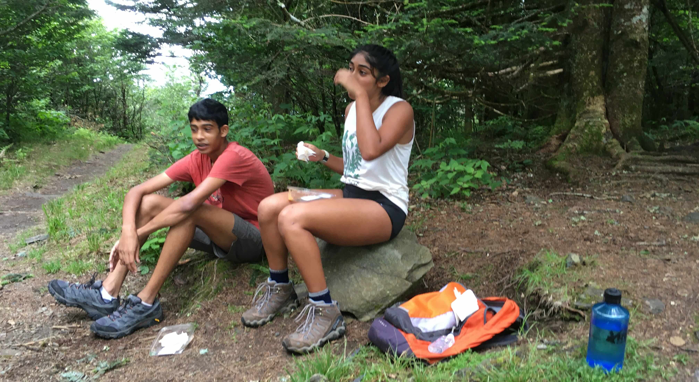

+++
date = '2021-07-01T00:00:00-04:00'
draft = false
title = 'Kephart Prong'
coords = [35.609920, -83.368653]
+++

### Kephart Shelter via Kephart Prong Trail

* 3.9 mi
* 836' elevation gain
* 2.5 hours

### View from the AT

### At the Kephart Shelter
We split up here, meeting up at the AT & the Sweet Heifer Creek Trail intersection.

### Meeting up on the AT

https://www.alltrails.com/trail/us/north-carolina/kephart-shelter-via-kephart-prong
