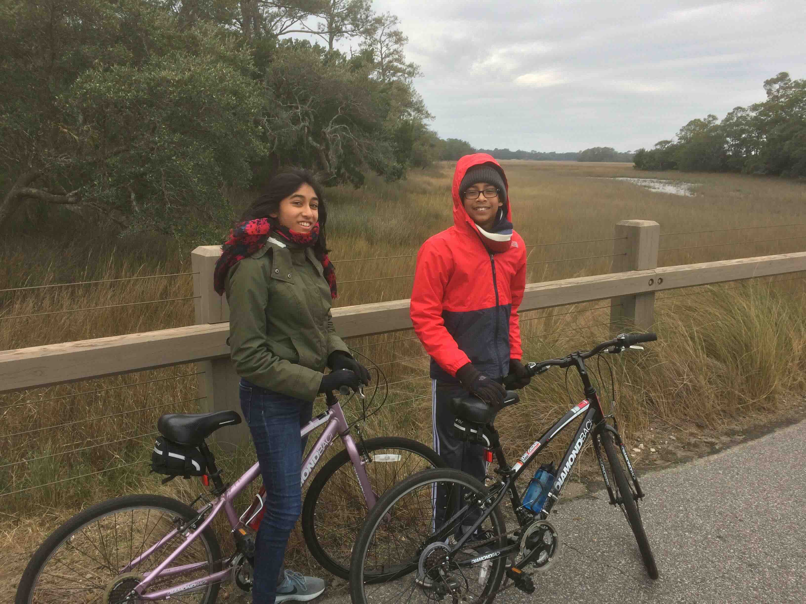
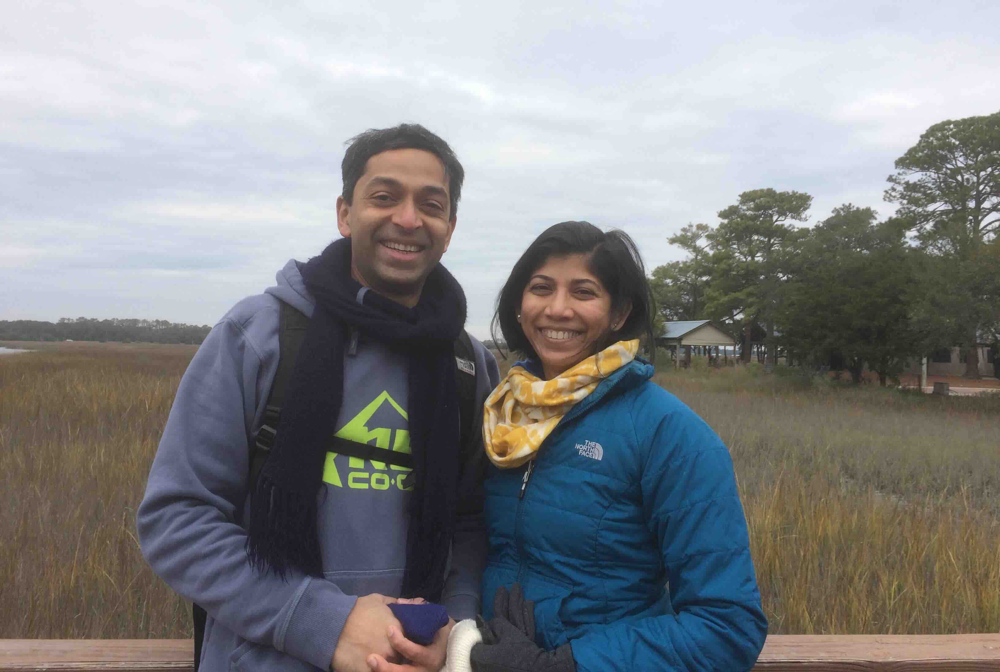

+++
date = '2017-12-28T00:00:00-04:00'
draft = false
title = 'Kiawah Island; Mingo Point'
coords = [32.597583, -80.132444]
+++

### Kiawah Island Mingo Point

* 5 mi
* 0' elevation gain
* 2 hours

### Biking on the island

### At Mingo Point

### Kiawah Island Trail

