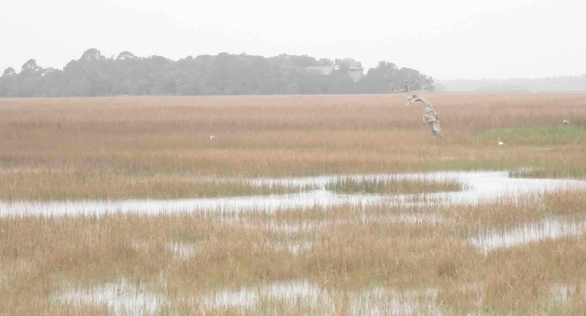
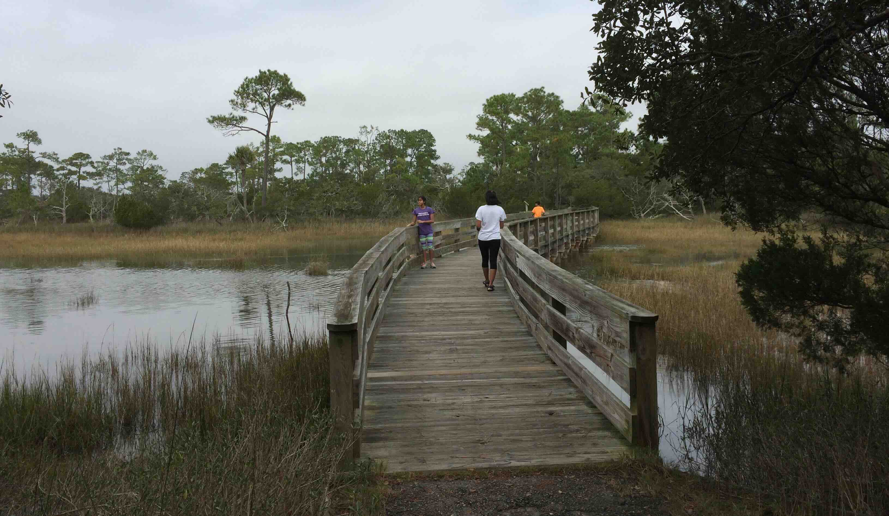
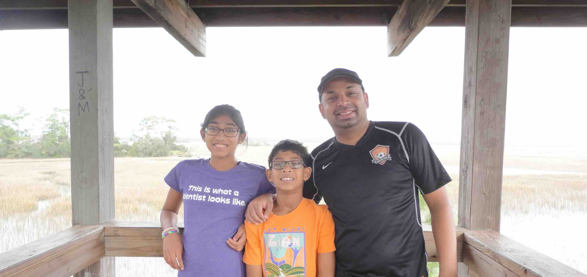
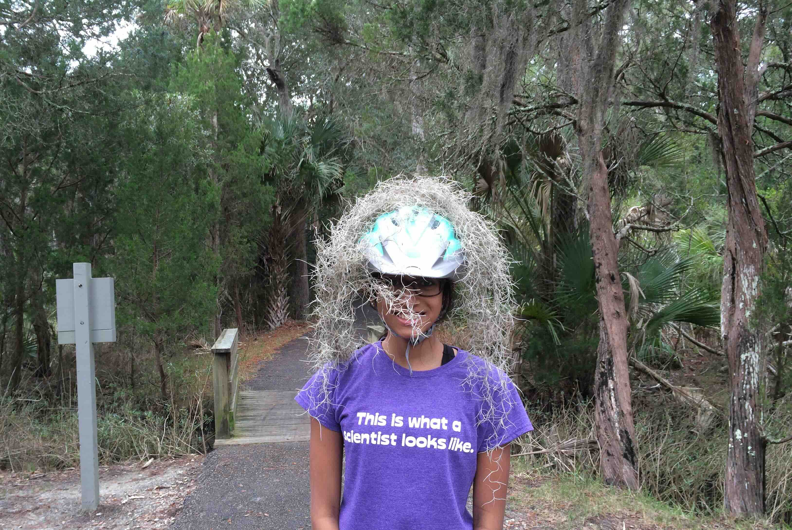

+++
date = '2015-12-29T00:00:00-04:00'
draft = false
title = 'Kiawah Island; Marsh Island Park'
coords = [32.620047, -80.064408]
+++

### Marsh Island Viewing Tower Trail

* 0.4 mi
* 3' elevation gain
* 1 hour

### View from the Viewing Tower

### The bridge to Marsh Island

### At the Viewing Tower

### Spanish Moss

[AllTrails - Marsh Island Viewing Tower Trail](https://www.alltrails.com/trail/us/south-carolina/marsh-island-viewing-tower-trail)
