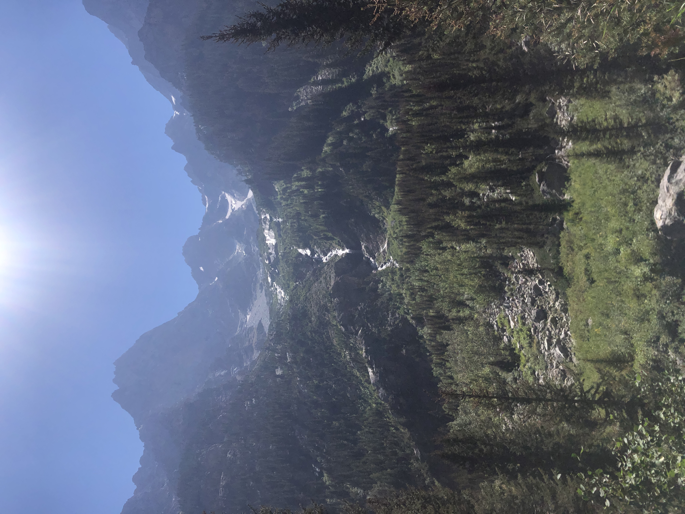

+++
date = '2023-08-17T00:00:00-04:00'
draft = false
title = 'Lake Solitude'
coords = [43.792397, -110.841453]
+++

## Lake Solitude via Cascade Canyon Trail 

* 13.9 mi
* 2362' elevation gain
* 7 hours

### Lake Solitude (elevation 9035')

### Grand Teton & the Teton Glacier from the Cascade Canyon Trail

https://www.alltrails.com/trail/us/wyoming/lake-solitude-via-lake-solitude-and-cascade-canyon-trail
