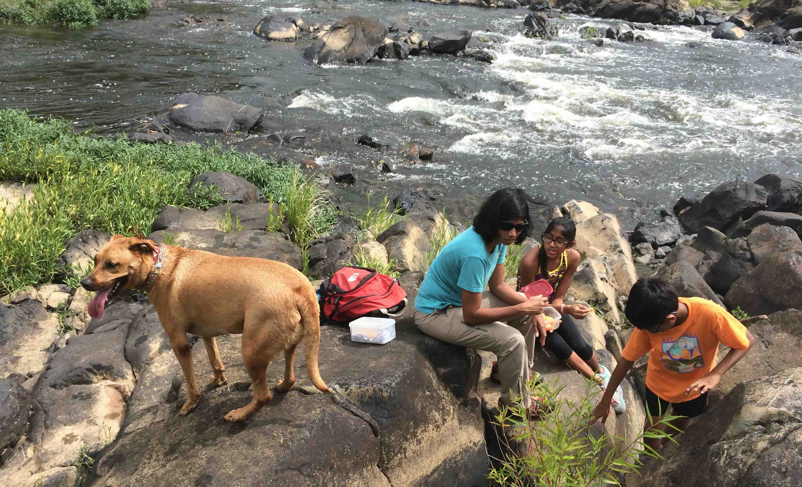

+++
date = '2015-09-06T00:00:00-04:00'
draft = false
title = 'Lower Haw River'
coords = [35.726417, -79.101944]
+++

### Lower Haw River Trail

* 3.5 mi
* 190' elevation gain
* 1.5 hours

### Lower Haw River Trail

### View of the river

[AllTrails - Lower Haw River Trail](https://www.alltrails.com/trail/us/north-carolina/lower-haw-river-trail-south-of-us-64)
