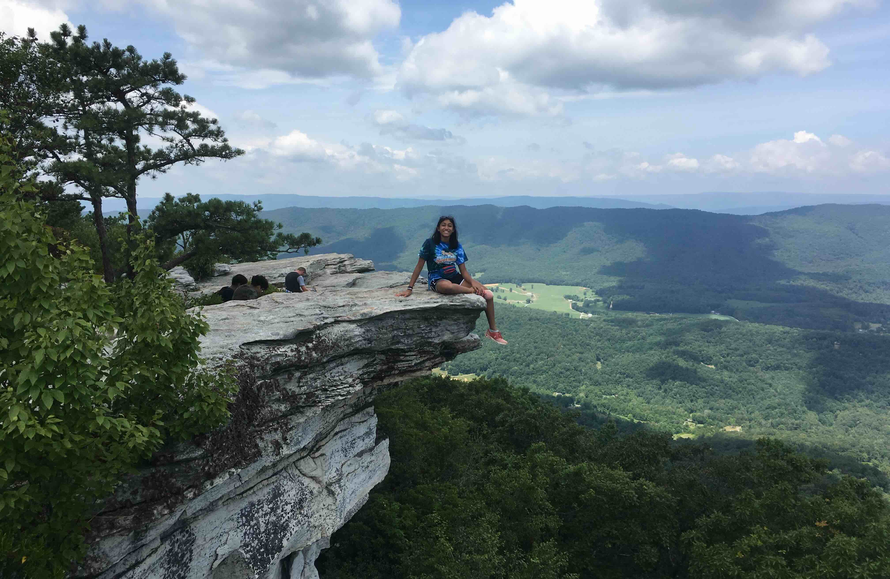

+++
date = '2019-06-30T00:00:00-04:00'
draft = false
title = 'McAfee Knob'
coords = [37.392850, -80.036864]
+++

### McAfee Knob, Appalachian Trail

* 7.9 mi
* 1830' elevation gain
* 4.5 hours

### Panorama View

### Out there

### At the top

### Family at the top

[AllTrails - McAfee Knob](https://www.alltrails.com/trail/us/virginia/mcafee-knob-appalachian-trail)
