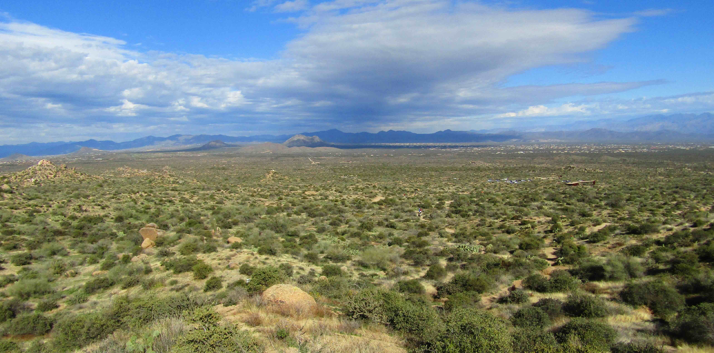
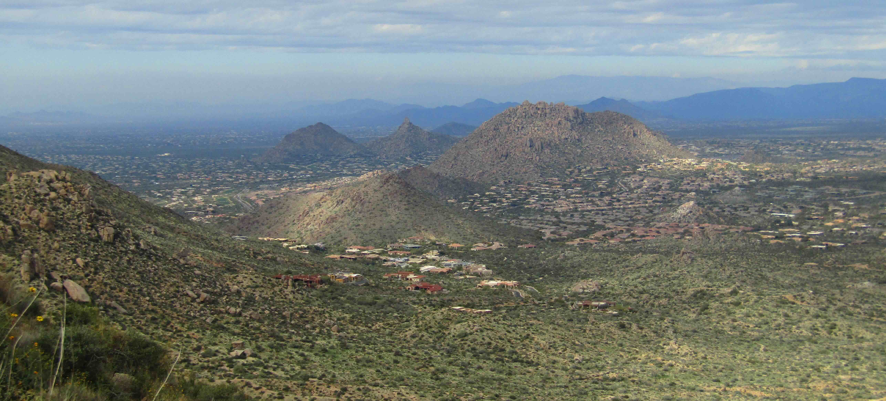
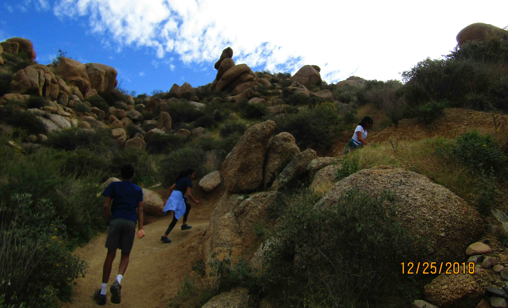
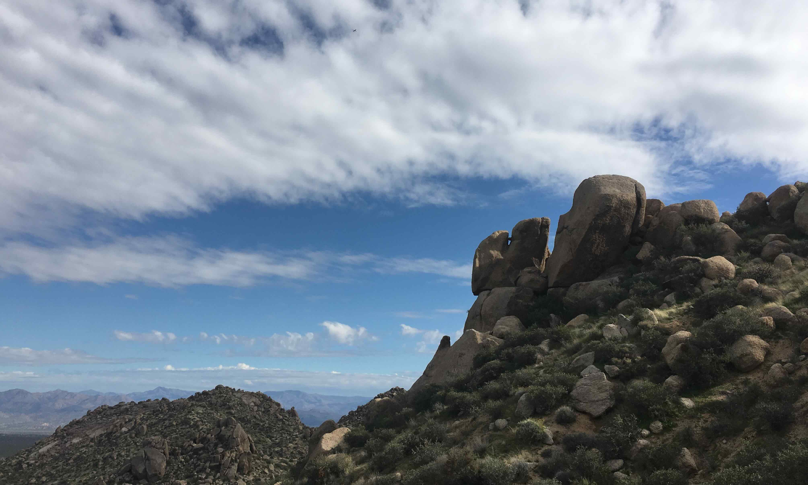
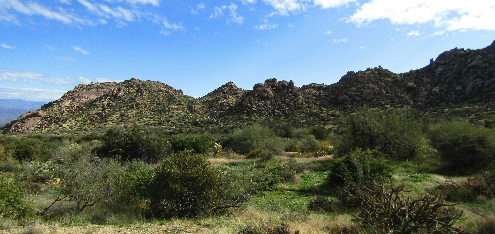

+++
date = '2018-12-25T00:00:00-04:00'
draft = false
title = 'Toms Thumb Trail'
coords = [33.693028, -111.802472]
+++

### Tom's Thumb Trail at the McDowell Sonoran Preserve

* 4.1 mi
* 1217' elevation gain
* 2 hours

### View from the trail

### Scottsdale from Tom's Thumb

### Hiking up

### Rock formations on the trail

### Views of the Preserve

[AllTrails - Tom's Thumb Trail](https://www.alltrails.com/trail/us/arizona/toms-thumb-trail)
