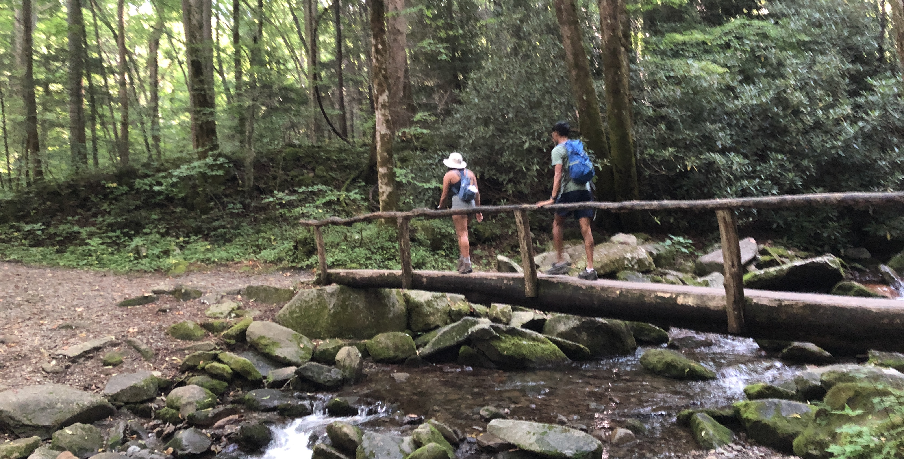
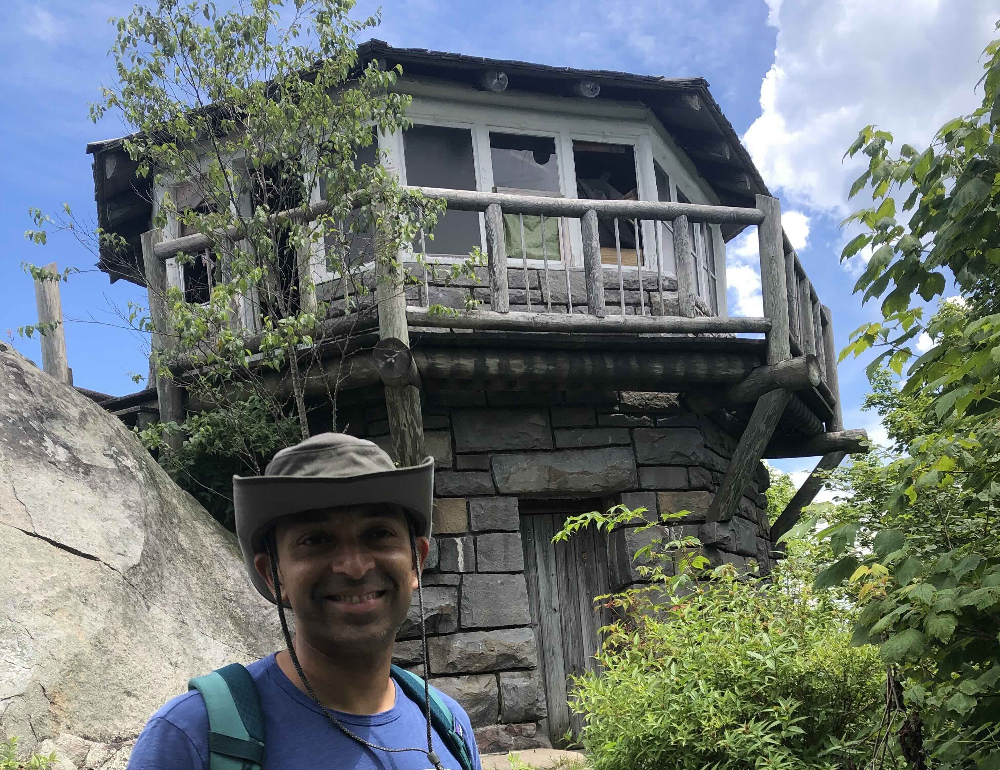

+++
date = '2022-08-05T00:00:00-04:00'
draft = false
title = 'Mount Cammerer'
coords = [35.763303, -83.161819]
+++

### Mount Cammerer via Low Gap Trail

* 11.1 mi
* 3149' elevation gain
* 7 hours

### Panorama at Mount Cammerer

### Starting out at Cosby Creek

### The historic fire tower at the summit

https://www.alltrails.com/trail/us/tennessee/mount-cammerer-via-low-gap-trail
