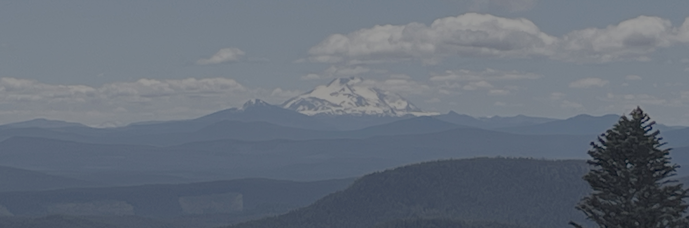

+++
date = '2025-06-28T00:00:00-04:00'
draft = false
title = 'Mount Hood'
coords = [45.343063, -121.747458]
+++

## Timberline Trail to Zig Zag River

* 10 mi
* 1800' elevation gain
* 5 hours

### Mount Jefferson from Mount Hood

### ZigZag Falls on the Timberline Trail

https://www.alltrails.com/trail/us/oregon/pacific-crest-trail-paradise-park-loop-757-and-paradise-park-trail-778
