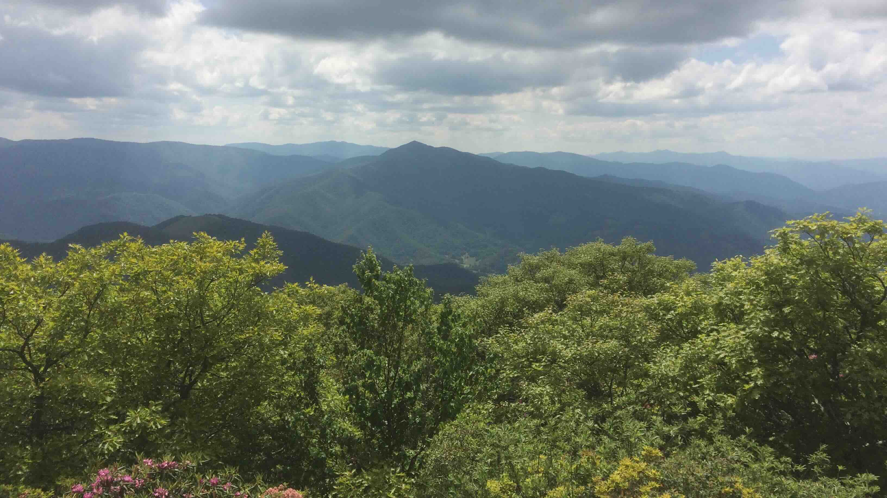
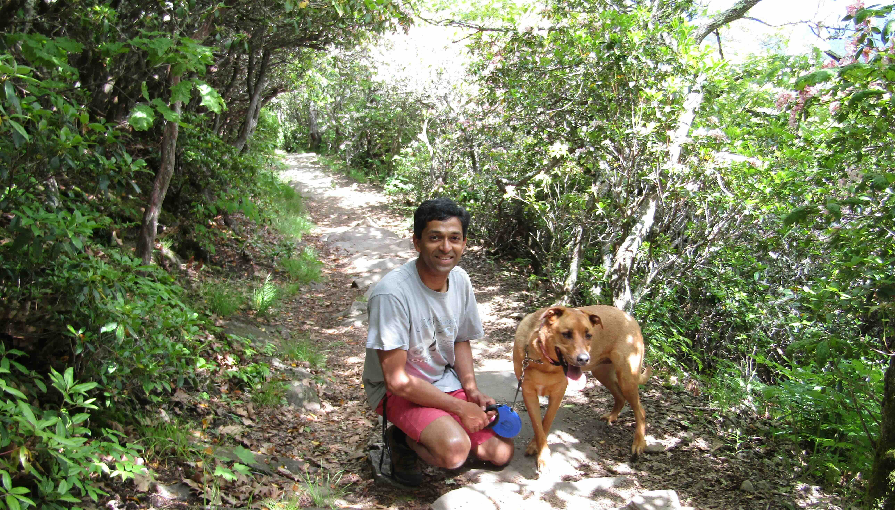
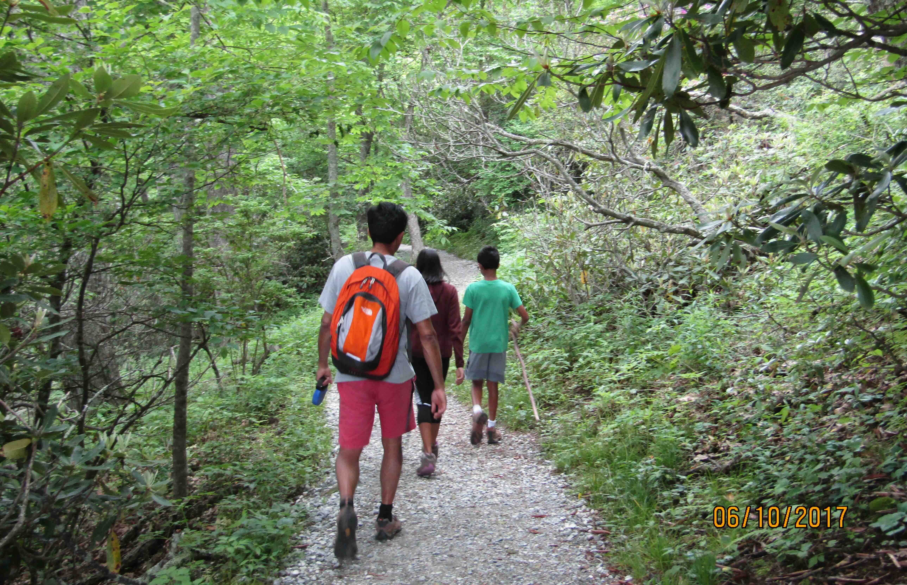

+++
date = '2017-06-10T00:00:00-04:00'
draft = false
title = 'Mount Pisgah (Redux)'
coords = [35.425663, -82.756797]
+++

### Back at Mount Pisgah

* 4.7 mi
* 1036' elevation gain
* 2.5 hours

### View from the summit

### Bella on the trail

### Rhododendron in bloom

### On the trail

[AllTrails - Mount Pisgah Trail](https://www.alltrails.com/trail/us/north-carolina/mount-pisgah-area-trails)
