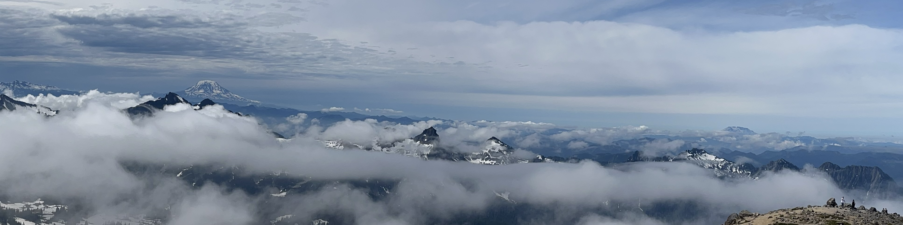
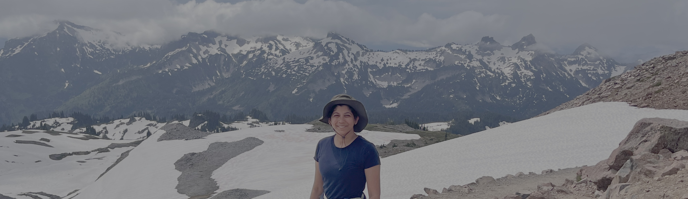

+++
date = '2025-07-04T00:00:00-04:00'
draft = false
title = 'Mount Rainier'
coords = [46.803600, -121.729700]
+++

## Skyline Loop

* 5.6 mi
* 1800' elevation gain
* 4 hours

### Panorama Point with Mount Adams & Mount St. Helens

### On the Skyline Trail

https://www.alltrails.com/trail/us/washington/skyline-trail
