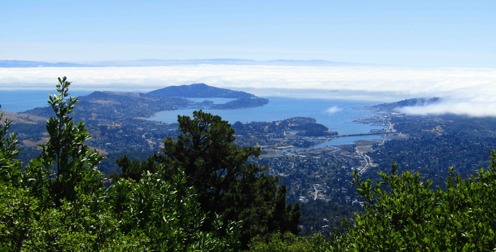
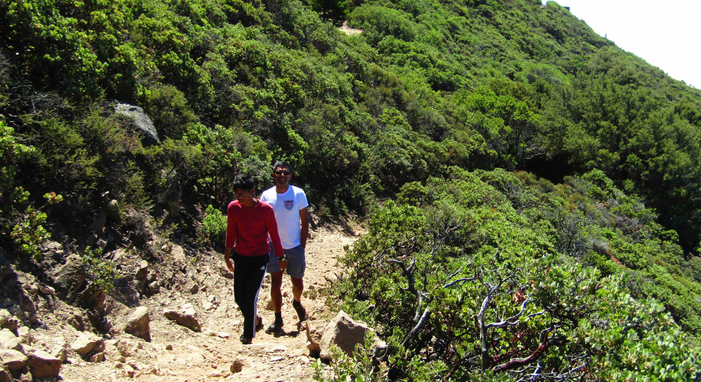
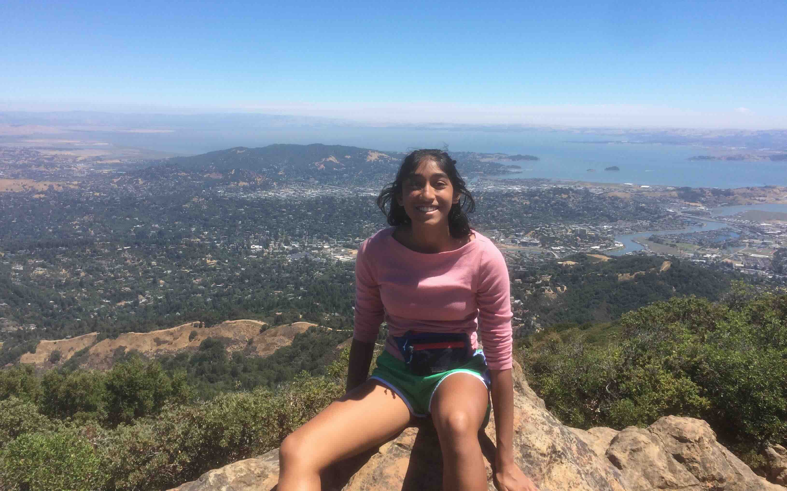
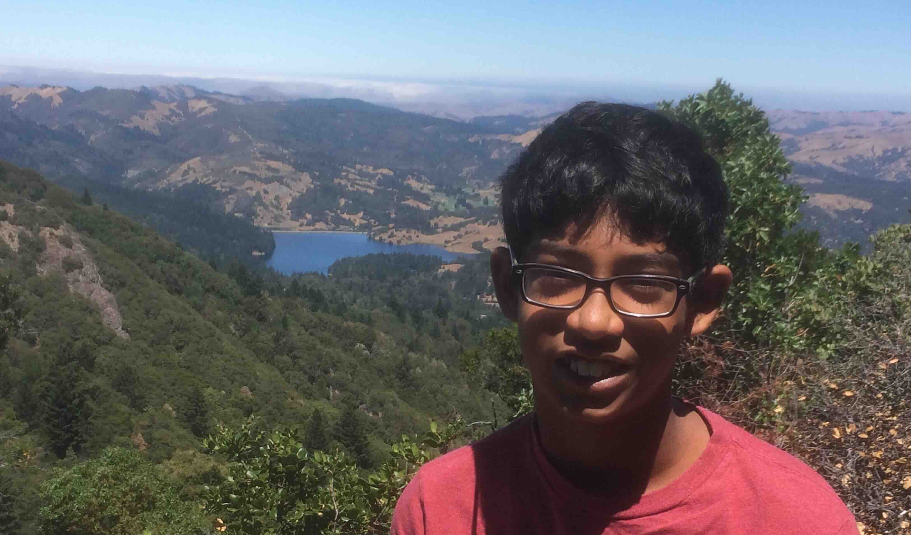
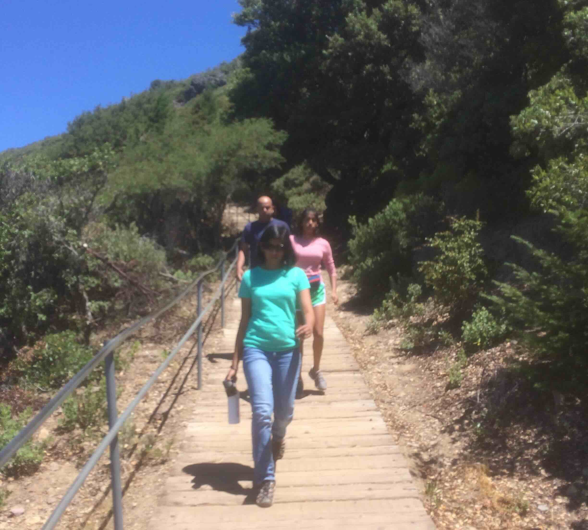

+++
date = '2018-07-27T00:00:00-04:00'
draft = false
title = 'Mount Tamalpais'
coords = [37.896203, -122.641372]
+++

### Mount Tamalpais to Stinson Beach

* 8.4 mi
* 4281' elevation gain
* 6 hours

### View of the SF Bay from Mount Tam

### On the way up

### Atop the east peak 

### Alpine Lake on the west face

### Down to Stinson Beach

[AllTrails - East Peak to Stinson Beach](https://www.alltrails.com/trail/us/california/stinson-beach-to-east-peak-via-steep-ravine-and-mountain-top-trails)
