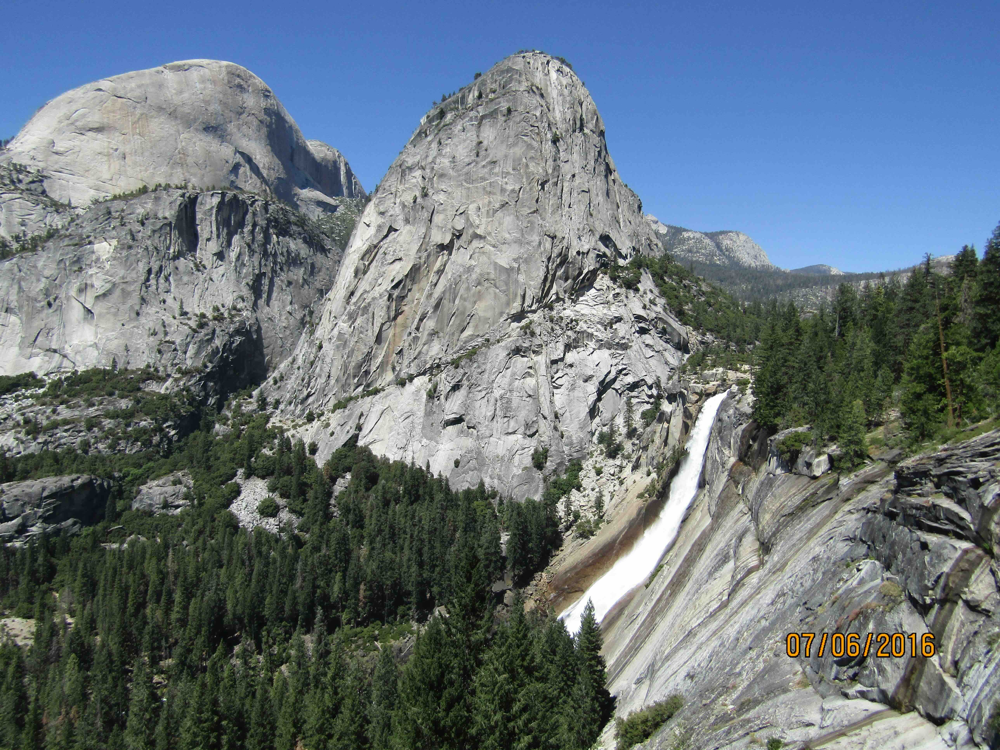
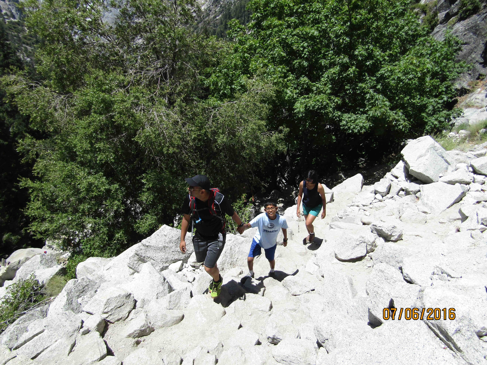
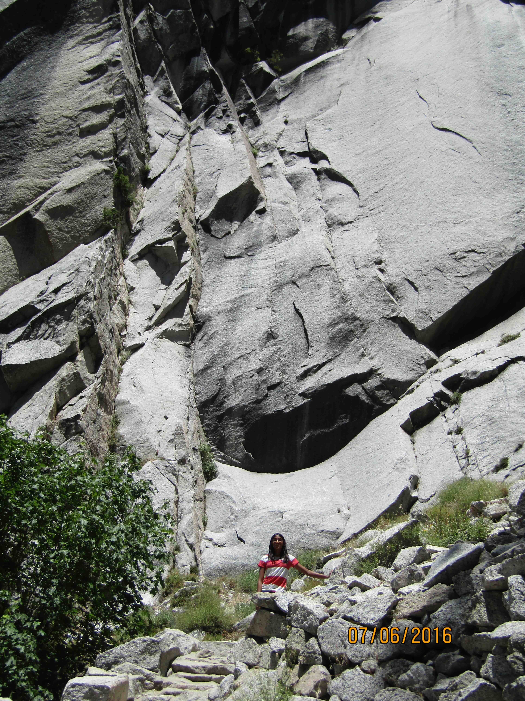
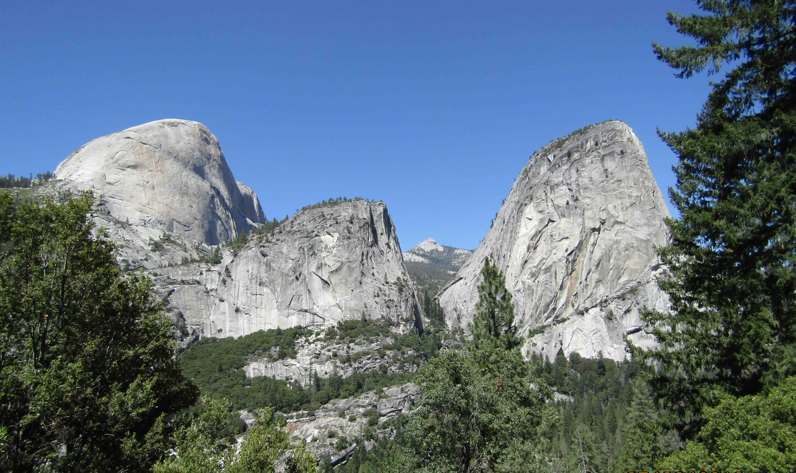
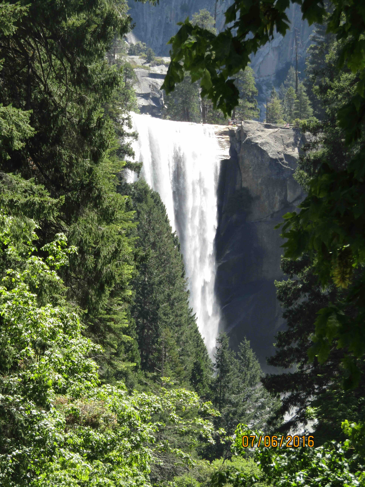
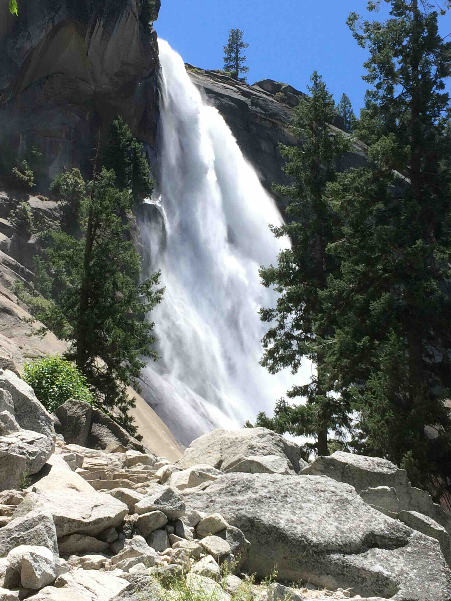
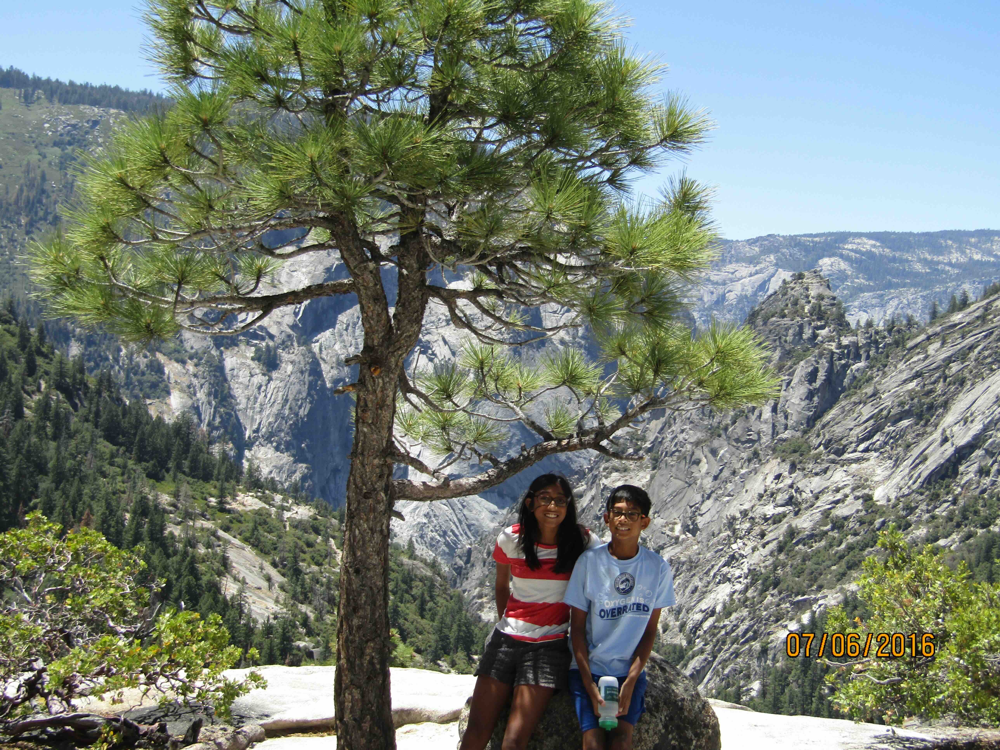
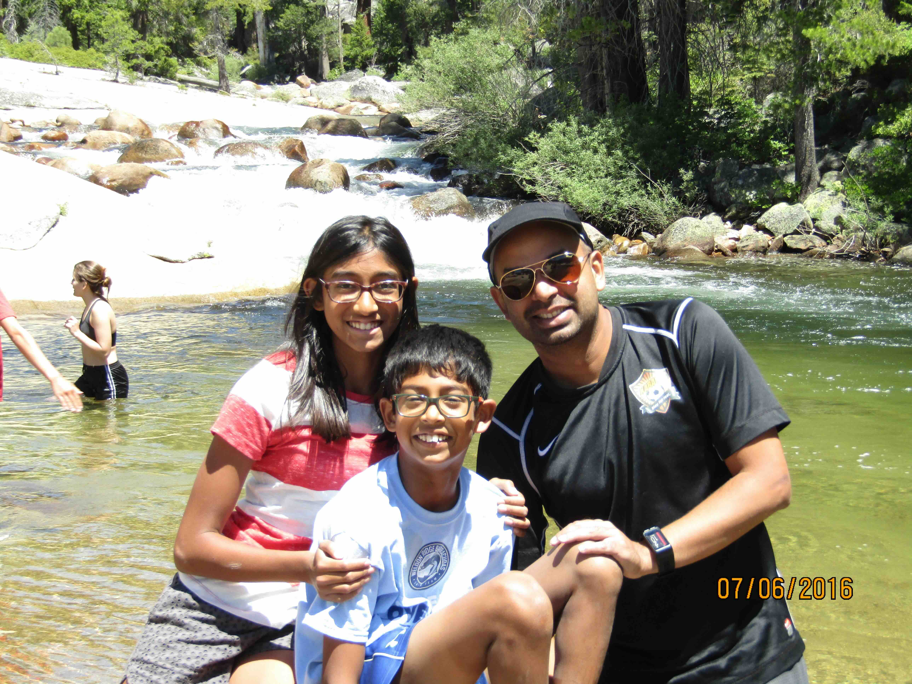
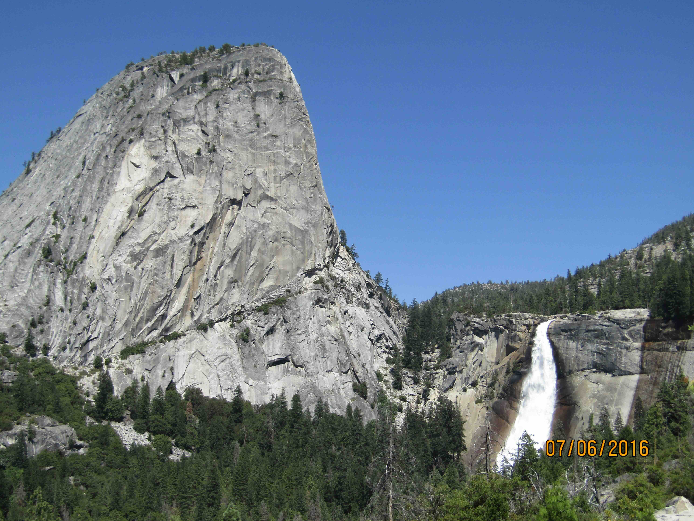

+++
date = '2016-07-06T00:00:00-04:00'
draft = false
title = 'Nevada Falls, Yosemite'
coords = [37.726472, -119.533914]
+++

### Vernal & Nevada Falls, Yosemite

* 6.6 mi
* 2158' elevation gain
* 5 hours

### Half Dome, Liberty Cap, & the Nevada Falls

### Hiking up the Mist Trail

### Sheer rocks on the Mist Trail

### Half Dome, Mount Broderick, & Liberty Cap

### Vernal Falls

### Approaching the Nevada Falls

### Yosemite Valley

### Merced River @ the Nevada Falls

### View of Liberty Cap & the Nevada Falls from the Mist Trail

[AllTrails - Vernal & Nevada Falls via the Mist Trail](https://www.alltrails.com/trail/us/california/vernal-and-nevada-falls-via-the-mist-trail)
