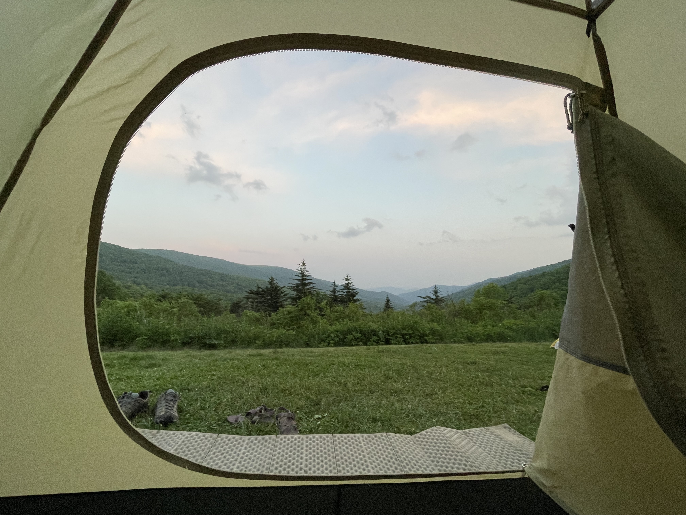
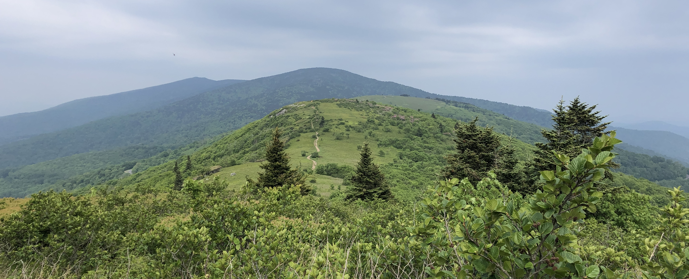
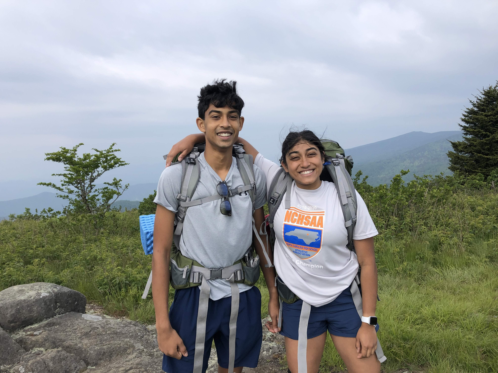

+++
date = '2023-06-11T00:00:00-04:00'
draft = false
title = 'Overmountain Shelter'
coords = [36.123947, -82.053872]
+++

## Carver's Gap to Yellow Mountain Gap

* 10.6 mi
* 2329' elevation gain
* 6 hours

### Overmountain Shelter at Yellow Mountain Gap

### The Roan Highlands Balds

### Backpacking to the Overmountain Shelter

https://www.alltrails.com/trail/us/tennessee/appalachian-trail-carvers-gap-to-yellow-mountain-gap
