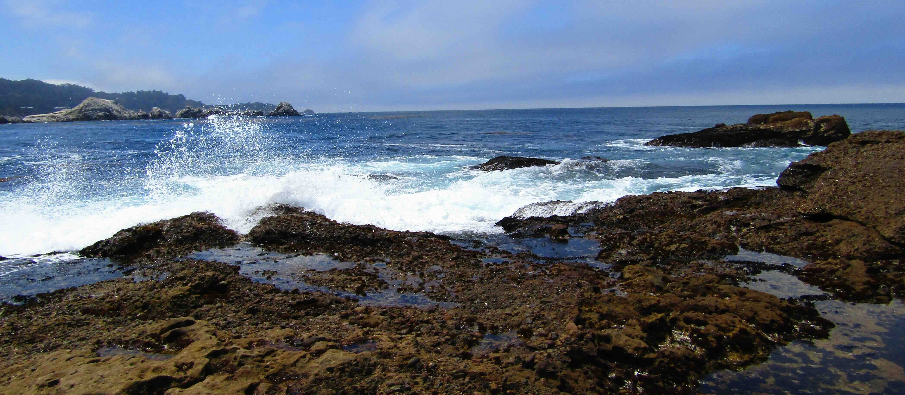
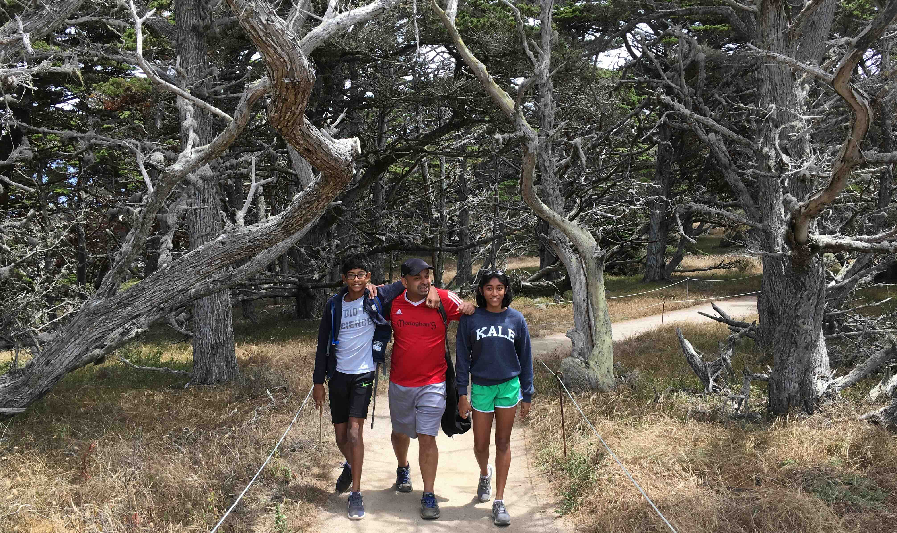
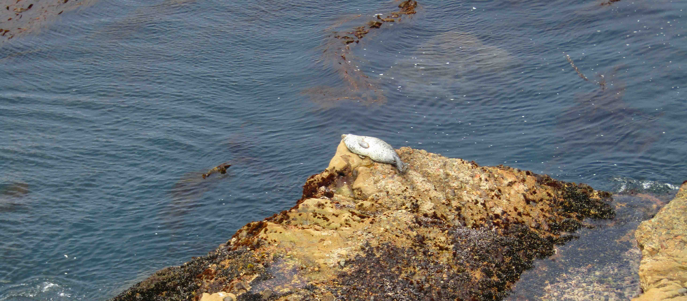
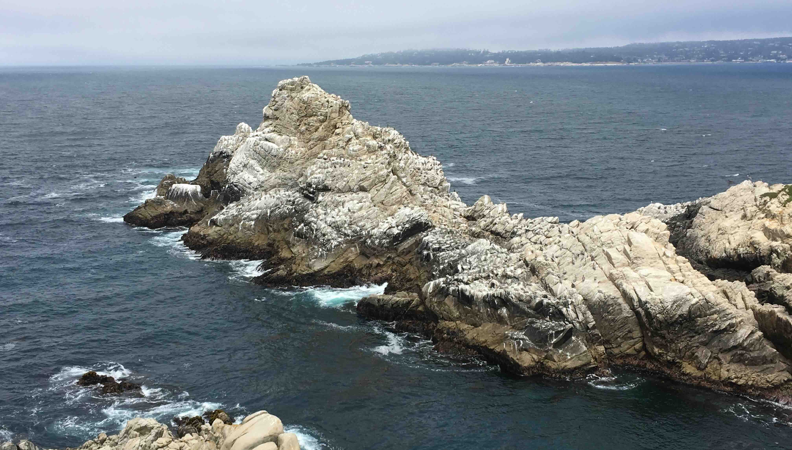
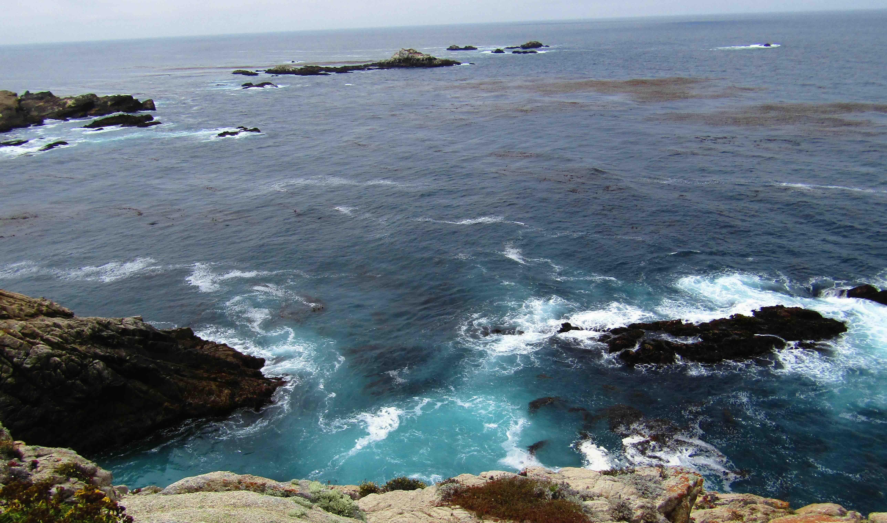
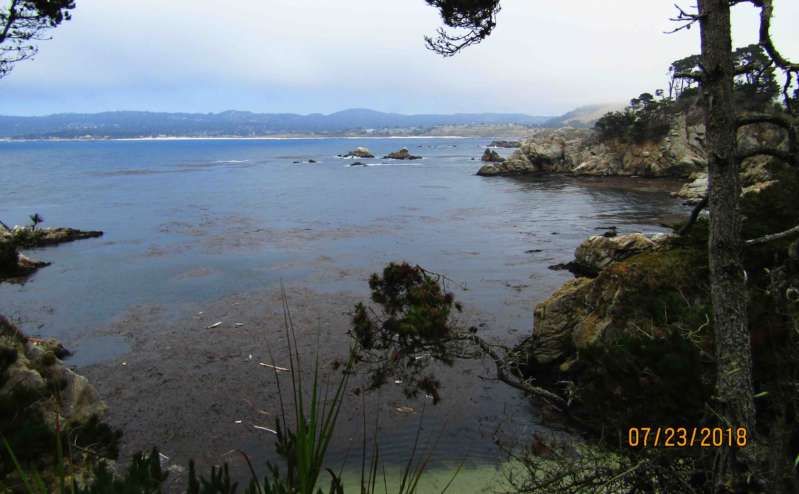
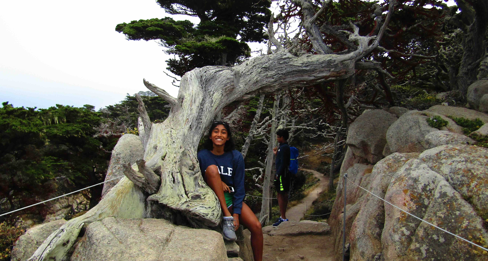
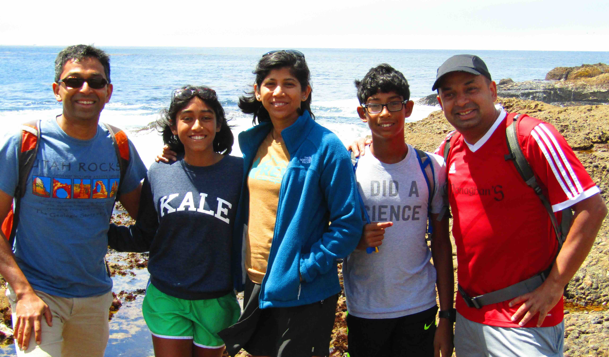

+++
date = '2018-07-23T00:00:00-04:00'
draft = false
title = 'Point Lobos'
coords = [36.522220, -121.953880]
+++

### Point Lobos Loop

* 6.3 mi
* 708' elevation gain
* 2.5 hours

### Waves breaking at Point Lobos

### Cypress Grove

### Basking Seal

### Cormorants on a headland with Pebble Beach in the background

### Kelp Forest

### Cypress Cove

### Beautiful cypress in the rocks

### The family

[AllTrails - Point Lobos Loop](https://www.alltrails.com/trail/us/california/point-lobos-loop-trail)
