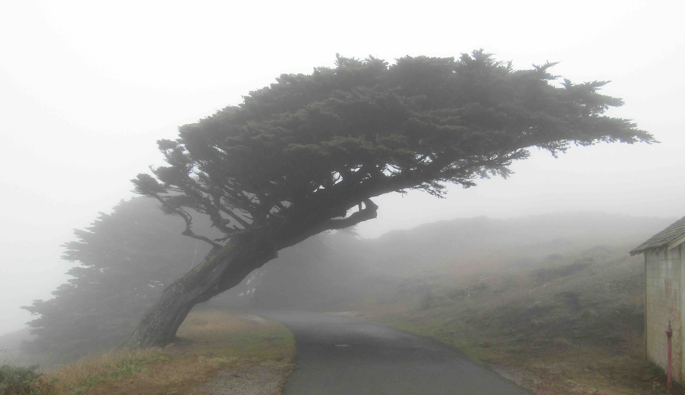
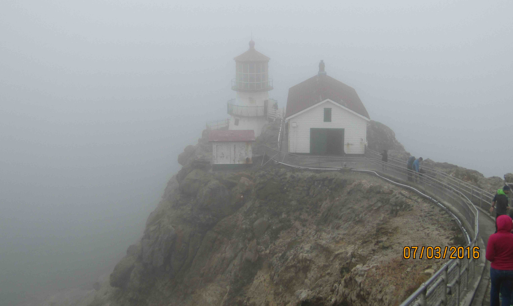
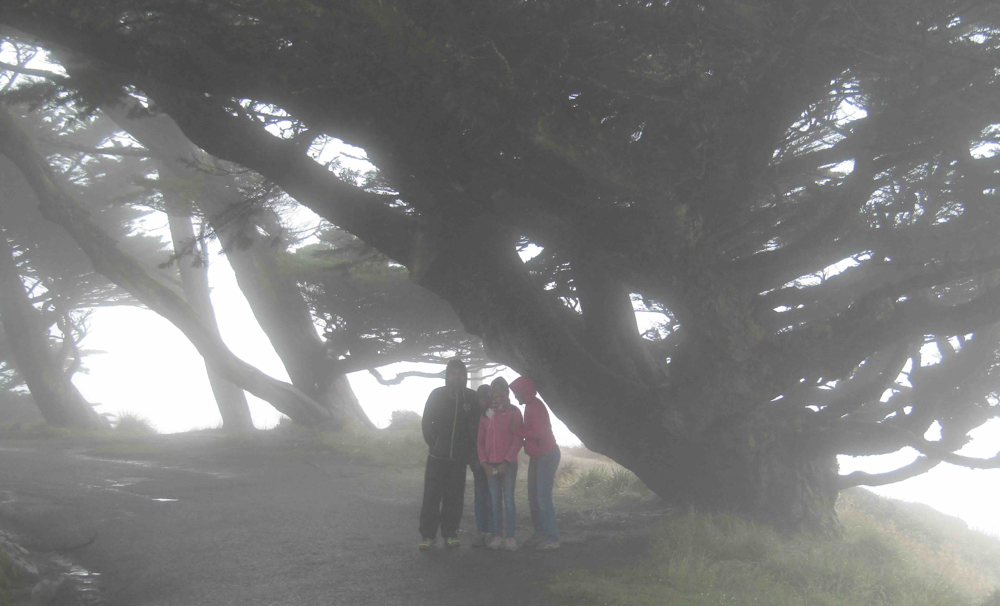
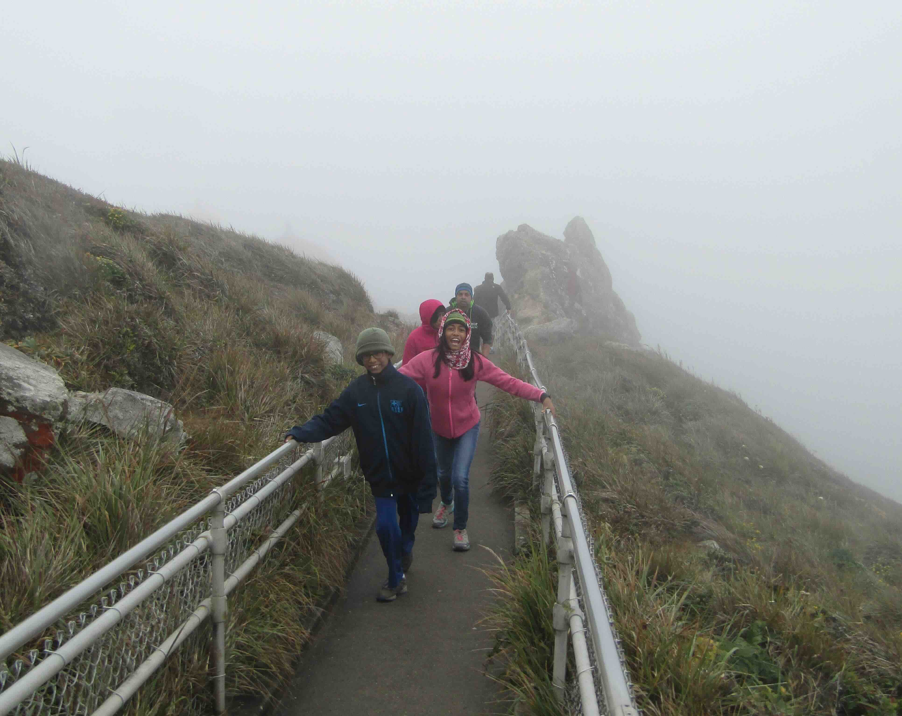
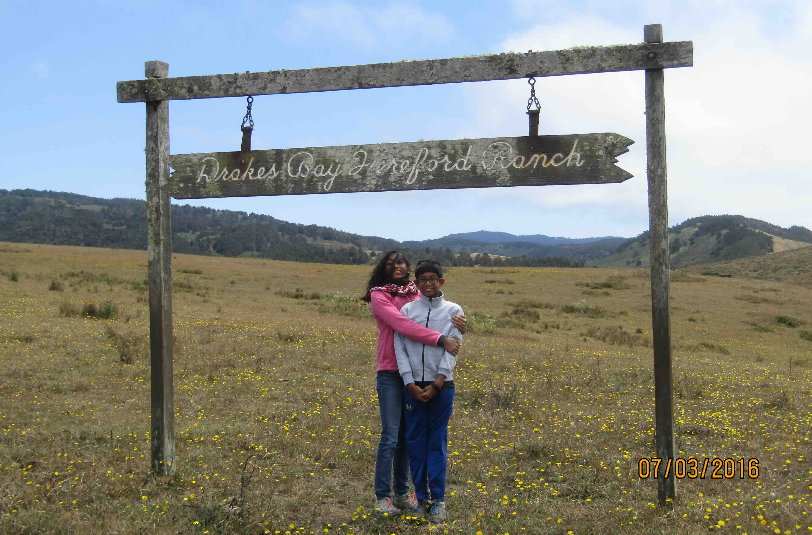
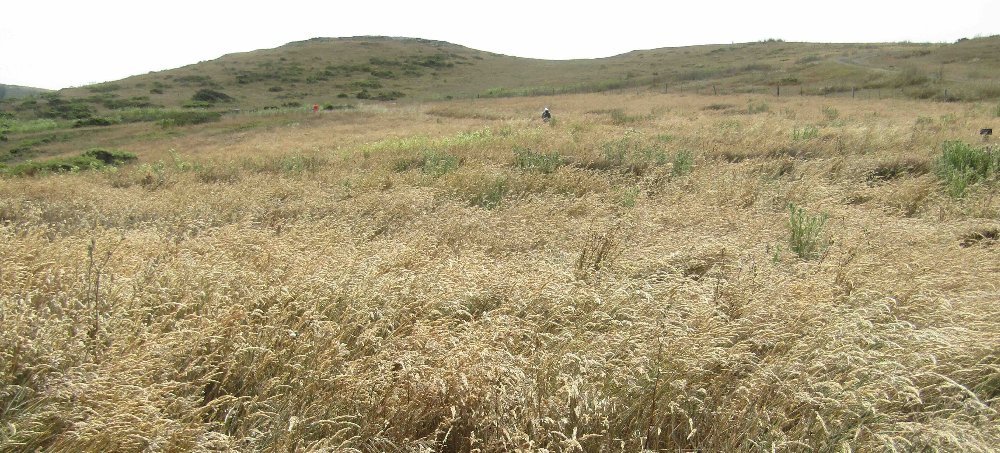
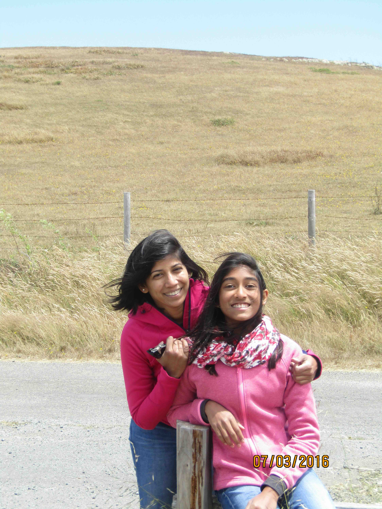

+++
date = '2016-07-03T00:00:00-04:00'
draft = false
title = 'Point Reyes Lighthouse'
coords = [38.081511, -122.914033]
+++

### Point Reyes Lighthouse Trail

* 1.3 mi
* 308' elevation gain
* 1 hour

### Cypress at Point Reyes

### The Lighthouse

### A small cypress grove

### Hiking up

### Exploring inland at Drakes Estero

### The mist lifts inland

### At Drakes Estero

[AllTrails - Point Reyes Lighthouse](https://www.alltrails.com/trail/us/california/point-reyes-lighthouse-visitor-center-trail)
