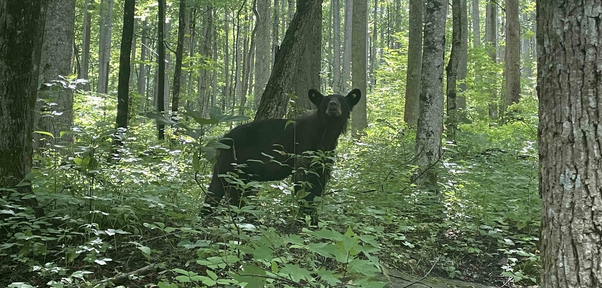

+++
date = '2022-08-06T00:00:00-04:00'
draft = false
title = 'Rainbow Falls'
coords = [35.662330, -83.464447]
+++

### Rainbow Falls Trail

* 5.1 mi
* 1594' elevation gain
* 3 hours

### At the falls

### Black bear at the Bullhead parking area

https://www.alltrails.com/trail/us/tennessee/rainbow-falls-trail
