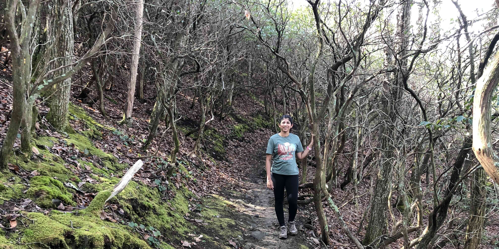
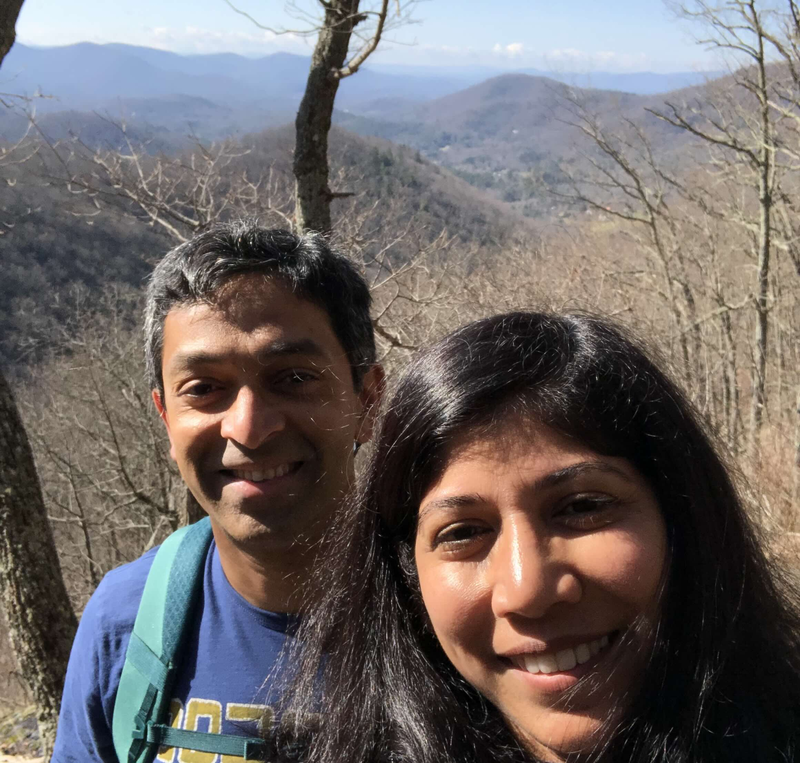

+++
date = '2022-03-19T00:00:00-04:00'
draft = false
title = 'Rattlesnake Lodge'
coords = [35.666425, -82.454903]
+++

### Rattlesnake Lodge Trail

* 3.8 mi
* 882' elevation gain
* 2 hours

### On the trail

### The Blue Ridge Mountains

https://www.alltrails.com/trail/us/north-carolina/rattlesnake-lodge-trail
