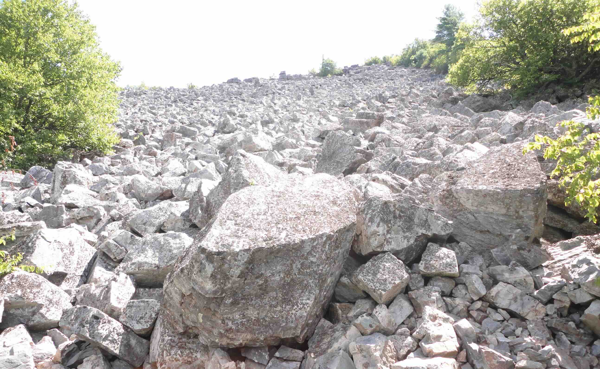
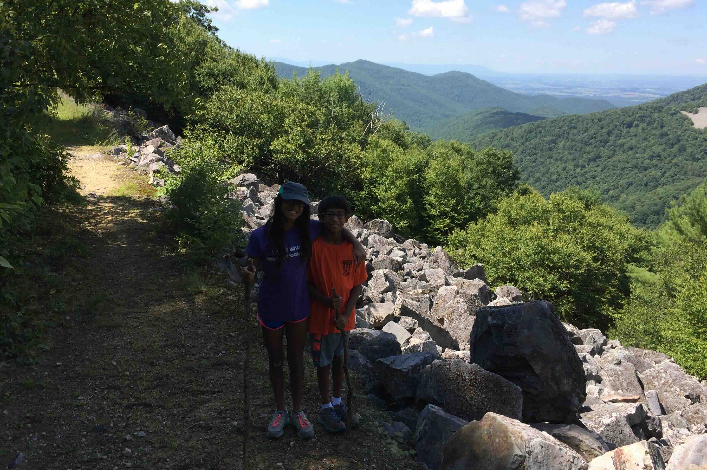
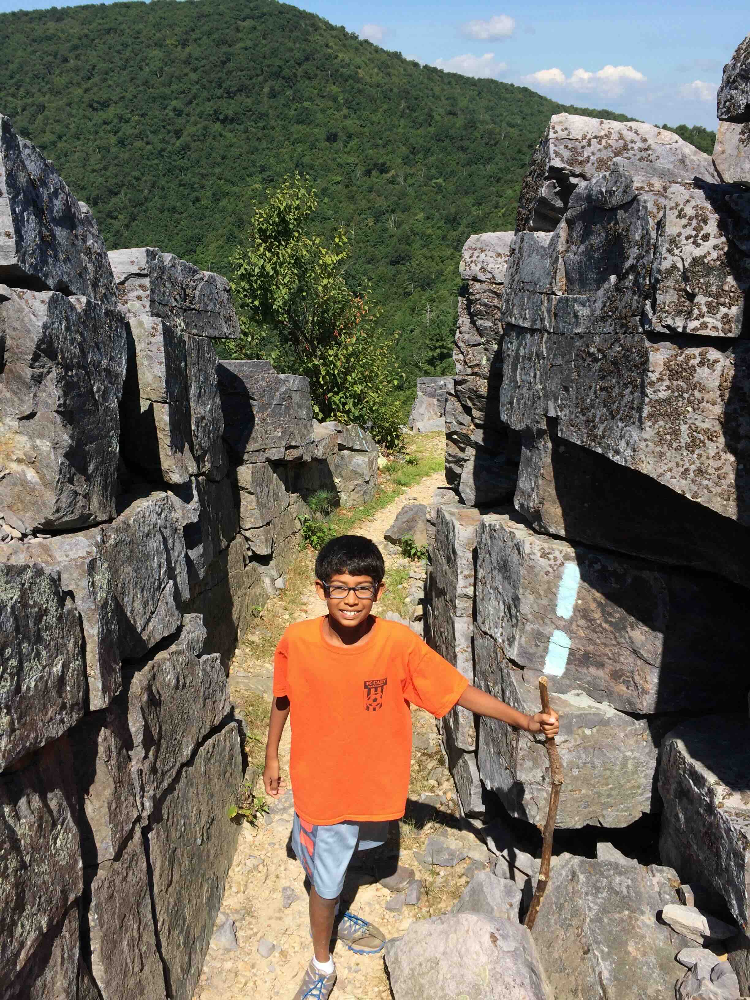
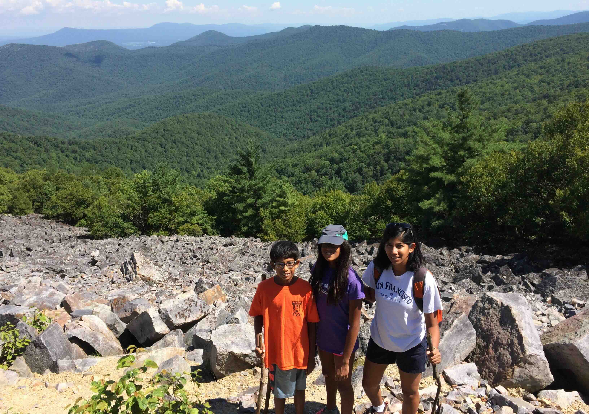
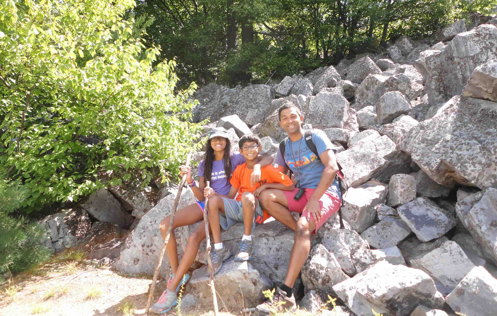

+++
date = '2015-08-01T00:00:00-04:00'
draft = false
title = 'Shenandoah; Blackrock Summit'
coords = [38.219731, -78.740547]
+++

### Shenandoah; Doyles River Falls

* 2 mi
* 187' elevation gain
* 1 hour

### Blackrock Summit

### Buddies on the trail

### Between a rock and a rock

### Shenandoah Valley

### Blackrock Summit Trail

[AllTrails - Blackrock Summit](https://www.alltrails.com/trail/us/virginia/blackrock-summit-via-trayfoot-mountain-and-appalachian-trail)
