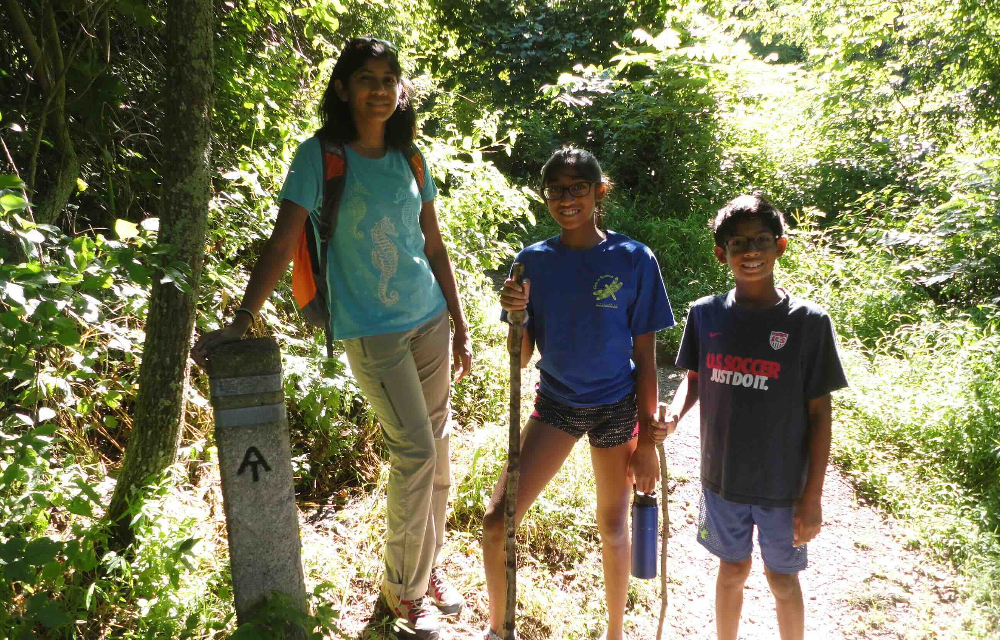
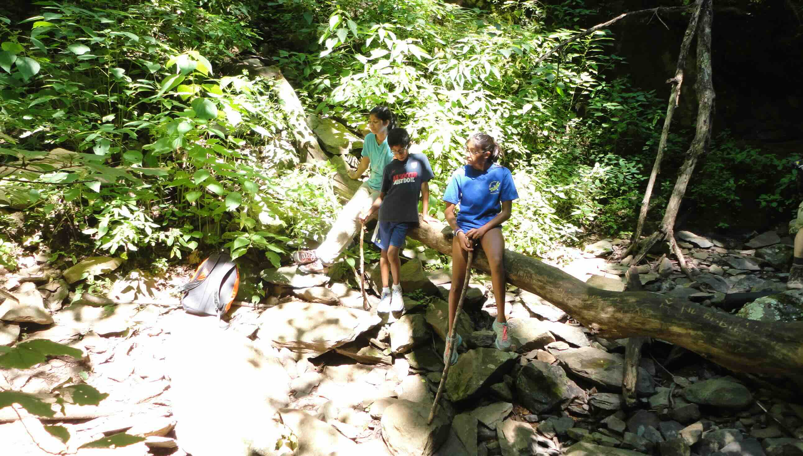
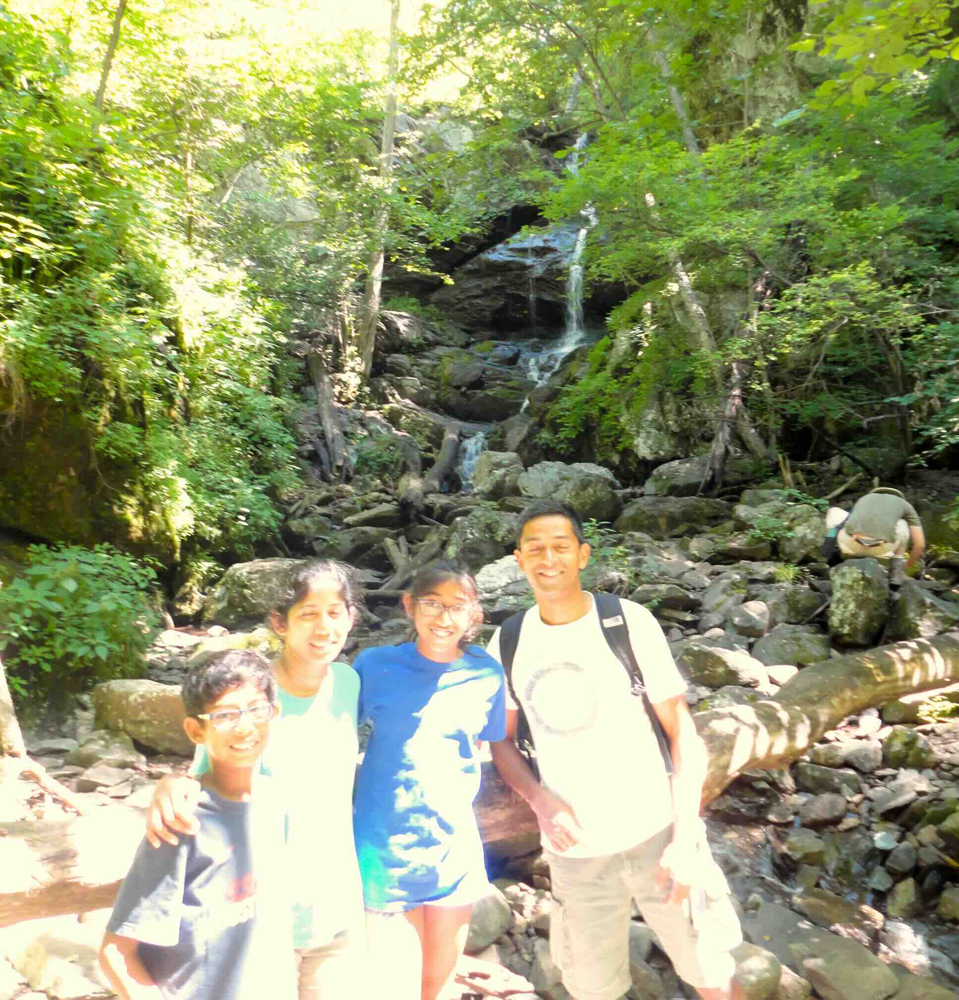
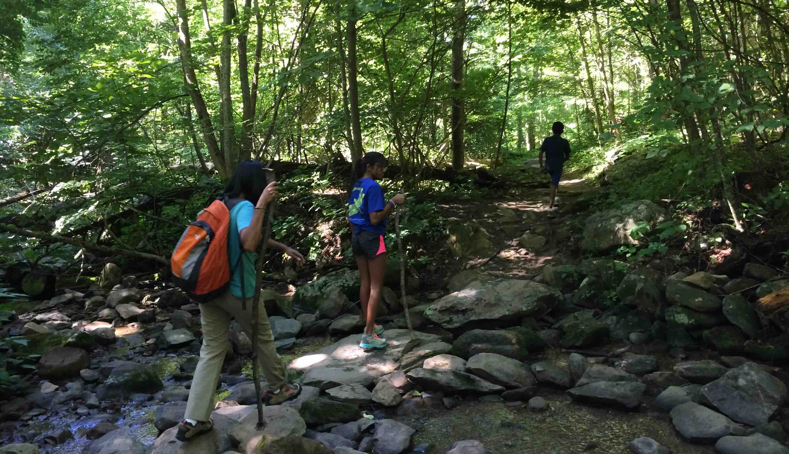

+++
date = '2015-07-31T00:00:00-04:00'
draft = false
title = 'Shenandoah; Doyles River Falls'
coords = [38.238256, -78.691253]
+++

### Shenandoah; Doyles River Falls

* 3.5 mi
* 1190' elevation gain
* 2.5 hours

### Starting out on the AT

### Doyles River Trail

### Doyles River Falls

### Fording the river

[AllTrails - Doyles River Falls Trail](https://www.alltrails.com/trail/us/virginia/doyles-river-falls-trail)
