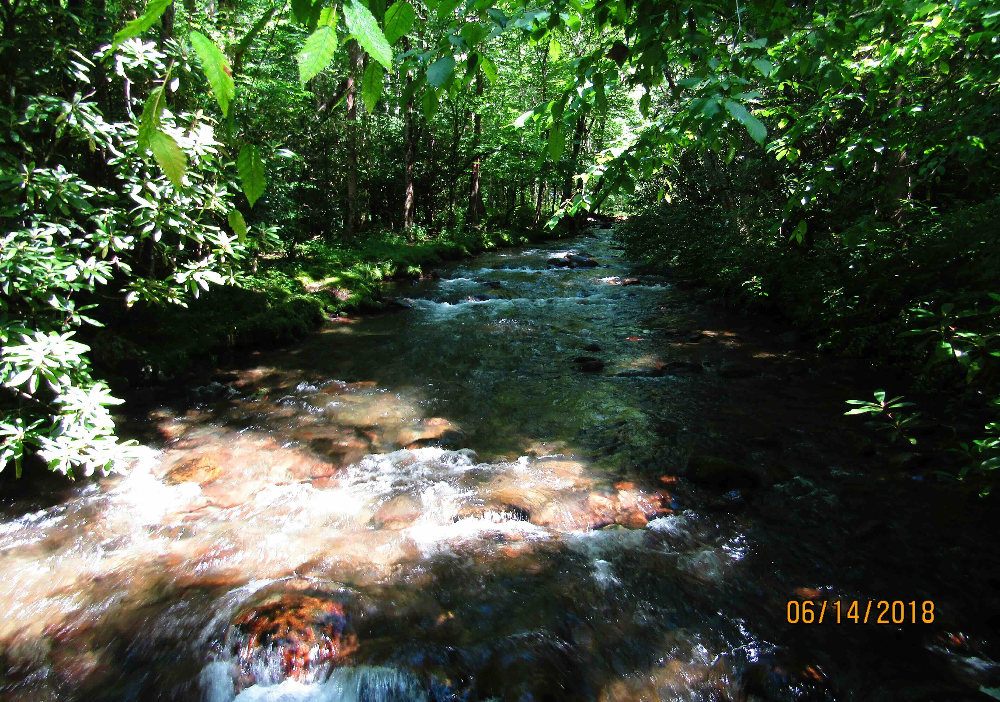
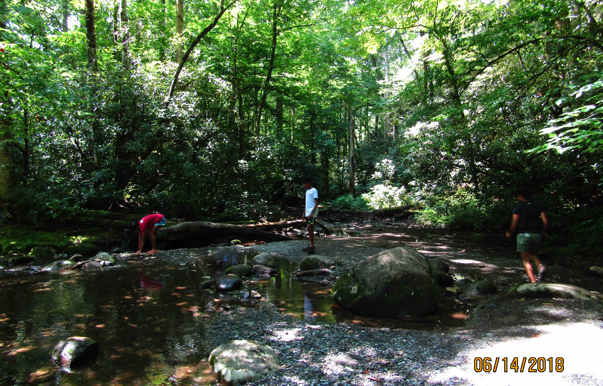
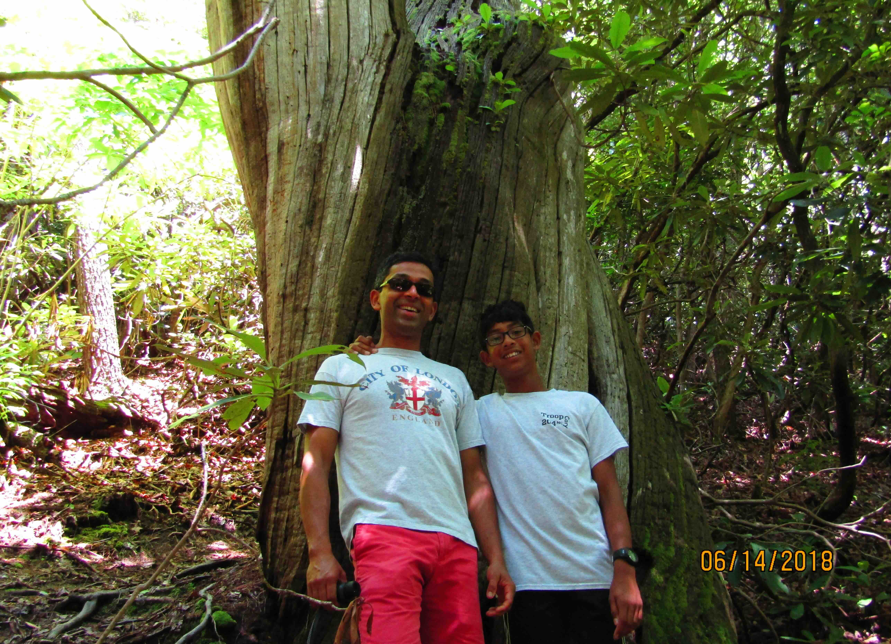
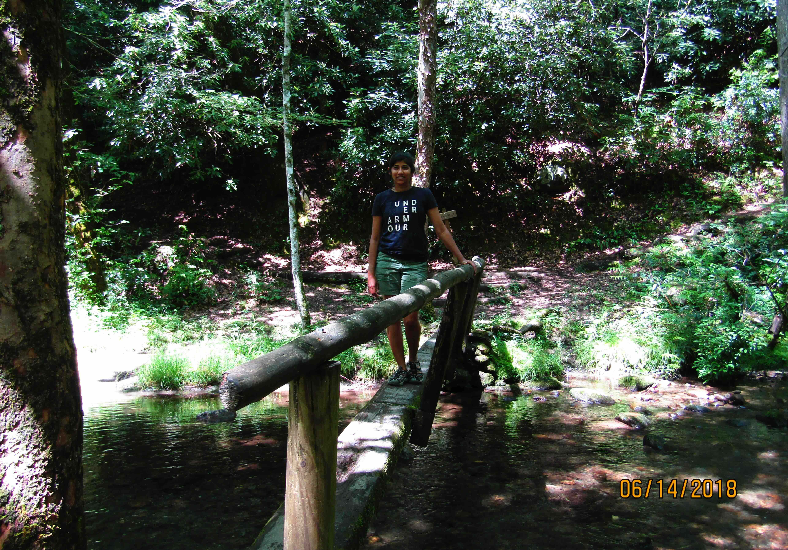

+++
date = '2018-06-14T00:00:00-04:00'
draft = false
title = 'Great Smoky Mountains; Smokemont'
coords = [35.558497, -83.314470]
+++

### Great Smoky Mountains; Smokemont Nature Trail

* 0.6 mi
* 160' elevation gain
* 0.75 hours

### Bradley Fork

### At the campground

### Crossing a stream 

### Taking a break

### Impressive tree

### Foot bridge

[AllTrails - Smokemont Nature Trail](https://www.alltrails.com/trail/us/north-carolina/smokemont-self-guided-nature-trail)
