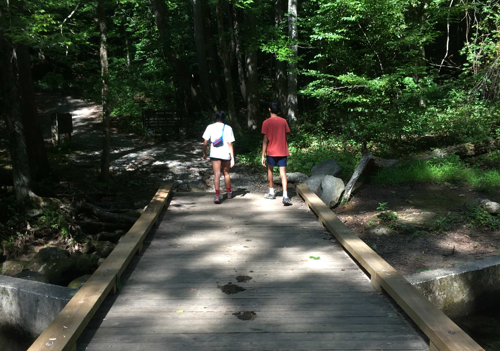
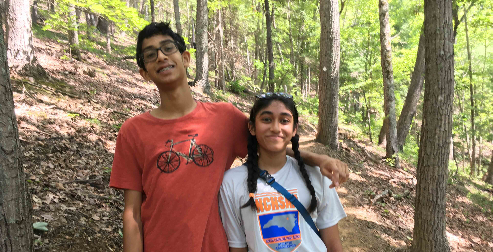
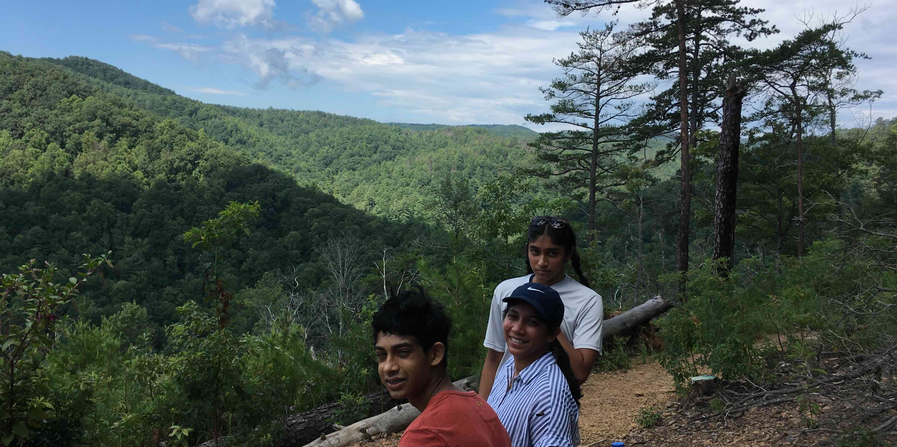
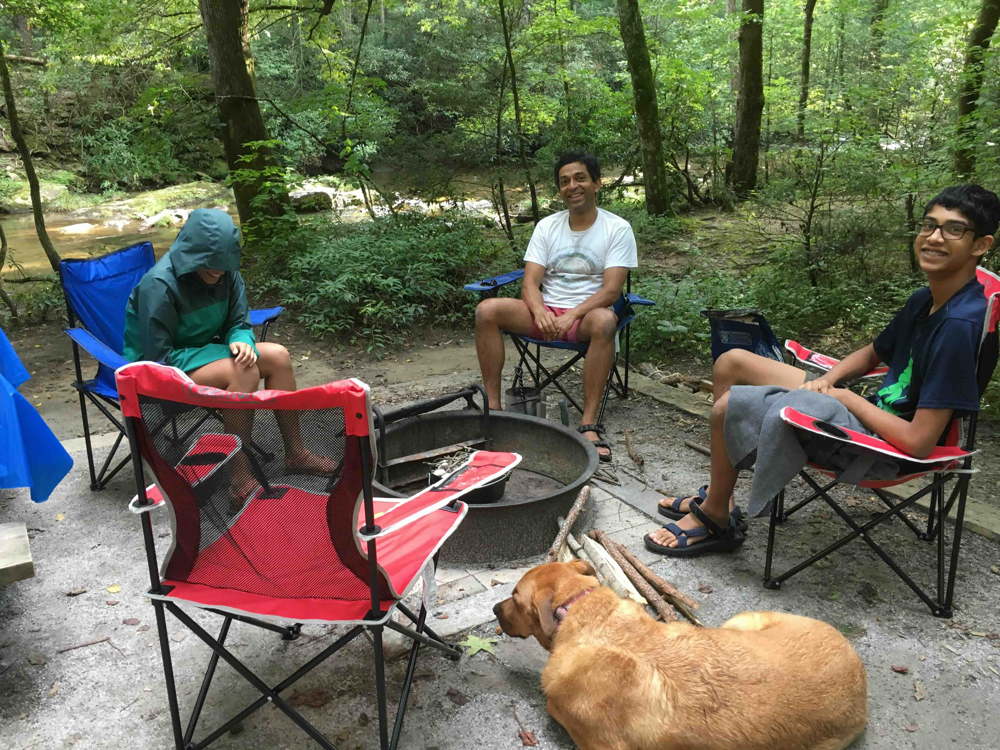

+++
date = '2020-08-10T00:00:00-04:00'
draft = false
title = 'Chestnut Knob Overlook at South Mountains State Park'
coords = [35.603622, -81.634980]
+++

### Chestnut Knob Overlook at South Mountains State Park

* 6.2 mi
* 1200' elevation gain
* 2.5 hours

### Starting out on the trail

### On the trail

### Chestnut Knob Overlook

### South Mountains Campground

[AllTrails - Chestnut Knob Overlook](https://www.alltrails.com/trail/us/north-carolina/chestnut-knob-hike)
