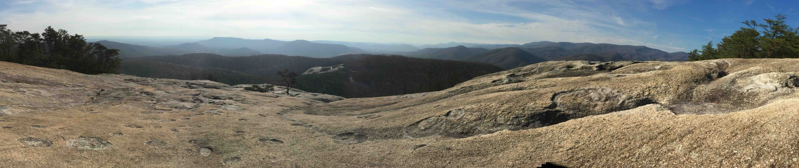
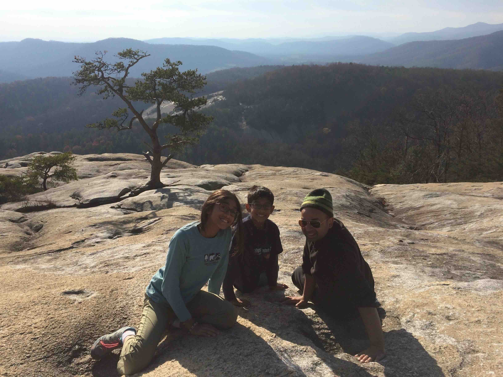
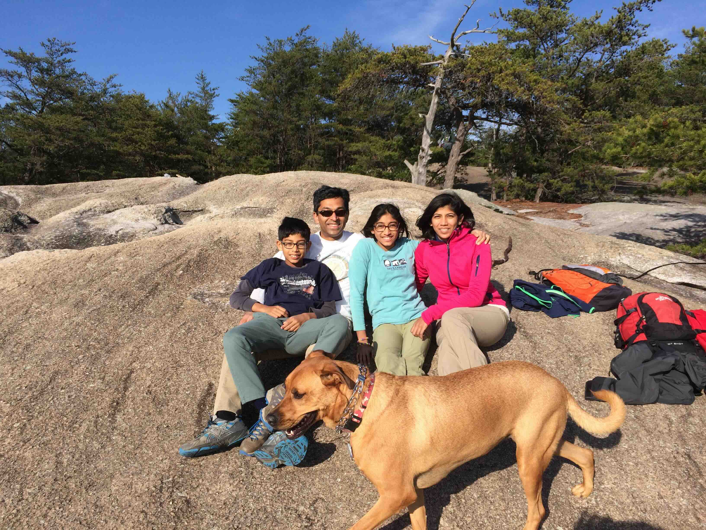
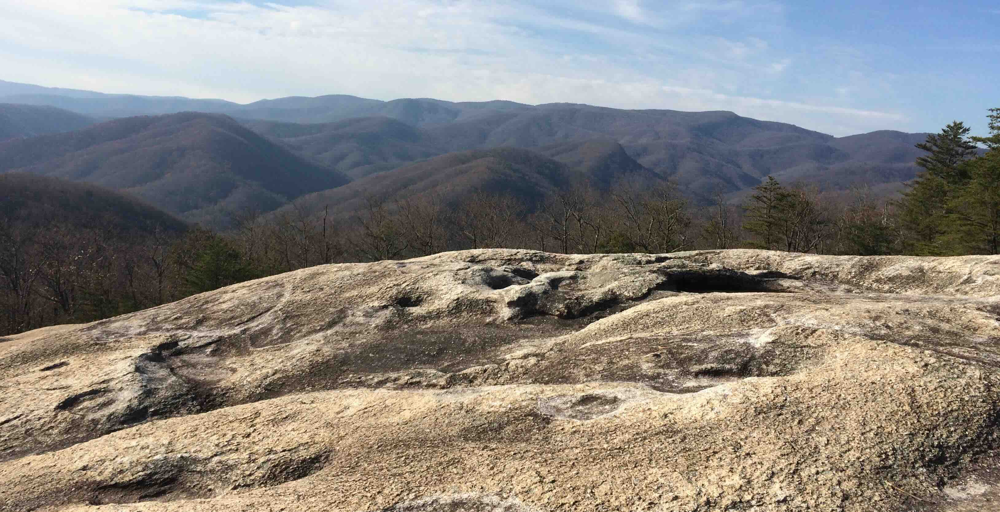
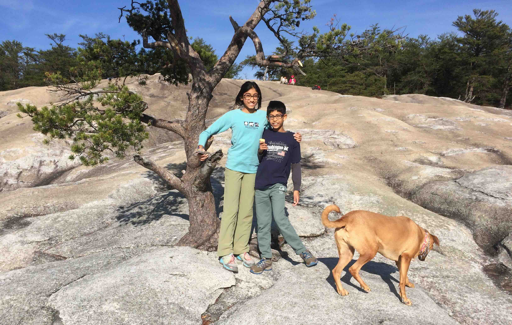

+++
date = '2015-11-25T00:00:00-04:00'
draft = false
title = 'Stone Mountain State Park'
coords = [36.393311, -81.044258]
+++

### Stone Mountain Loop Trail

* 4.9 mi
* 967' elevation gain
* 3 hours

### Panorama from the top

### Resting at the summit

### Bella made it too!

### Another view from the summit

### Tree at the summit

[AllTrails - Stone Mountain Loop Trail](https://www.alltrails.com/trail/us/north-carolina/stone-mountain-loop-trail)
