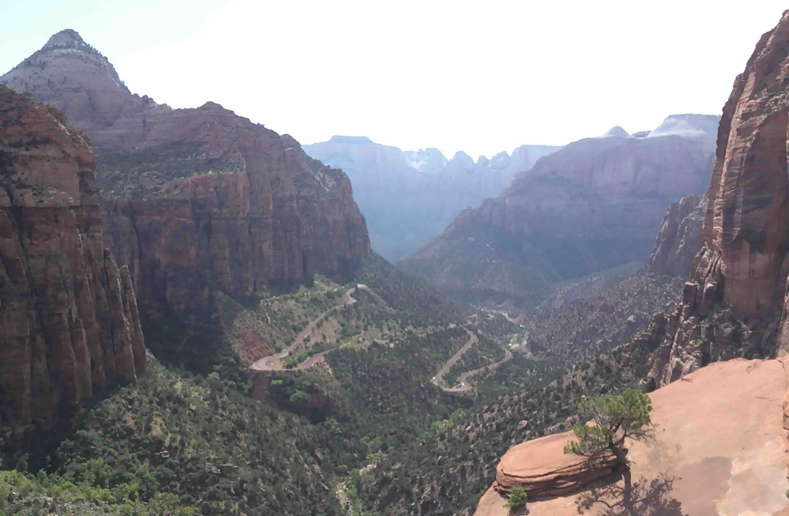
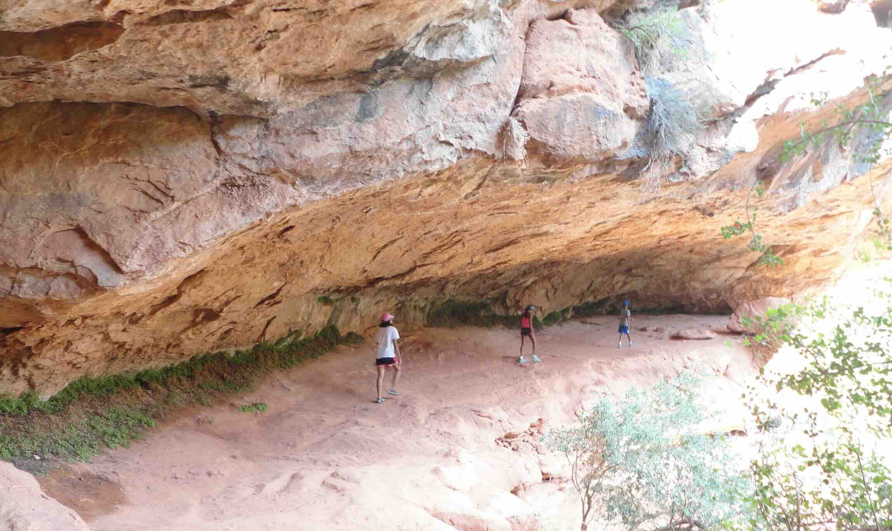
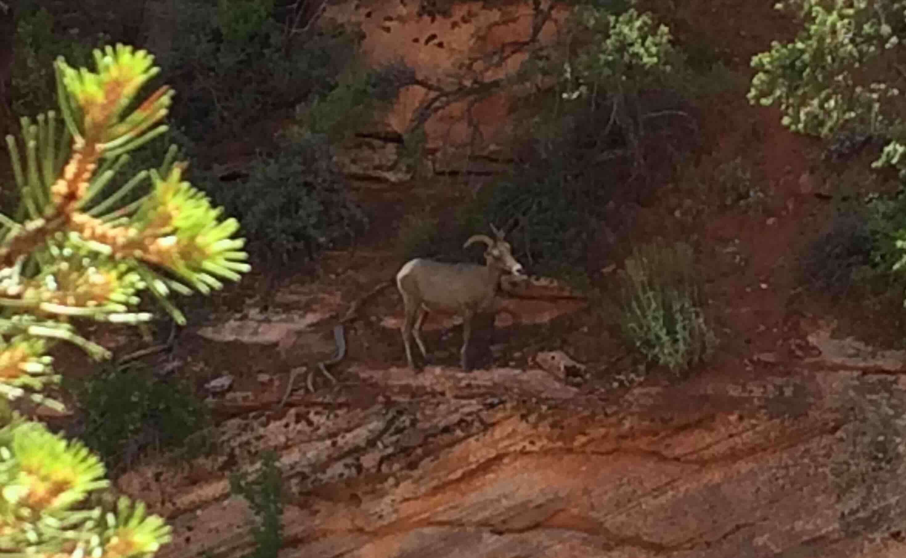
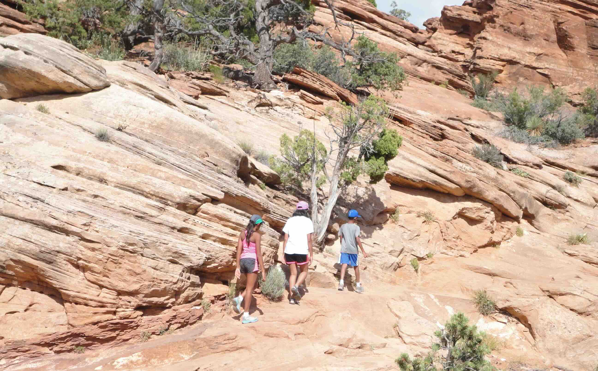

+++
date = '2015-07-01T17:00:00-04:00'
draft = false
title = 'Zion Canyon Overlook'
coords = [37.213511, -112.946144]
+++

### Zion Canyon Overlook

* 1 mi
* 213' elevation gain
* 1 hour

### Zion Canyon Overlook

### Hiking to the overlook

### Bighorn Sheep

### Overlook Trail

[AllTrails - Zion Canyon Overlook](https://www.alltrails.com/trail/us/utah/canyon-overlook-trail)
