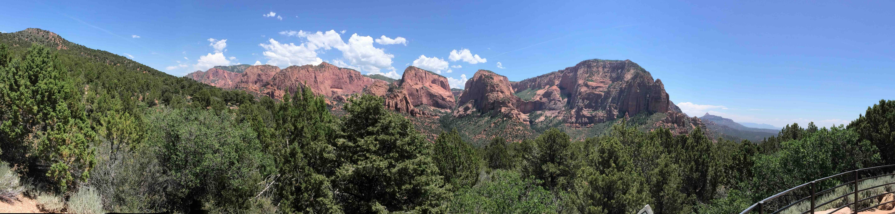
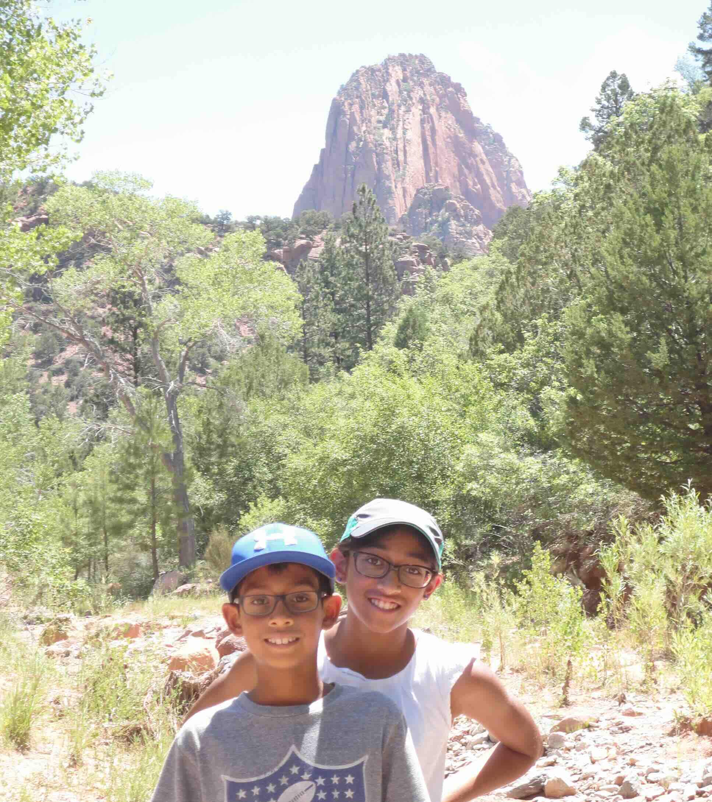
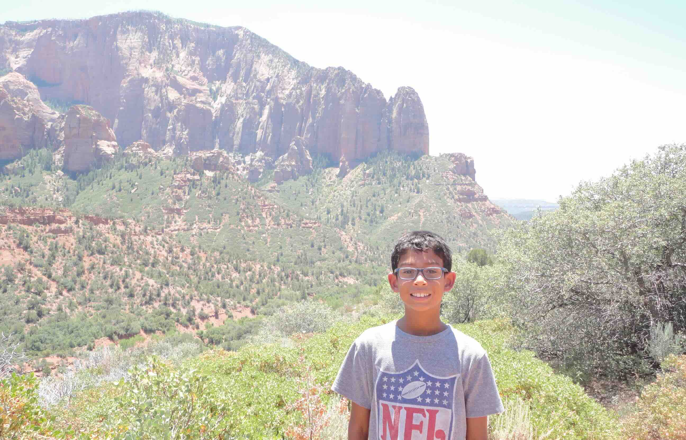
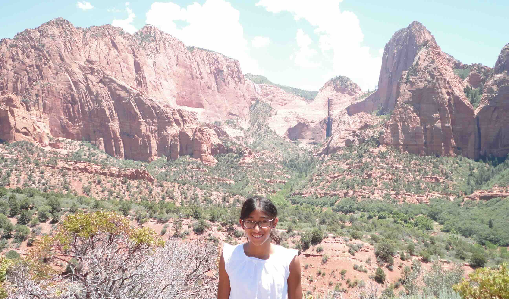

+++
date = '2015-06-29T00:00:00-04:00'
draft = false
title = 'Zion; Kolob Canyons'
coords = [37.464100, -113.194306]
+++

### Zion; Kolob Canyons; Taylor Creek Trail

* 5.1 mi
* 633' elevation gain
* 2 hours

### Kolob Canyons

### Taylor Creek Trail

### View of Kalob Canyons

[AllTrails - Taylor Creek Trail](https://www.alltrails.com/trail/us/utah/middle-fork-taylor-creek-trail--4)
