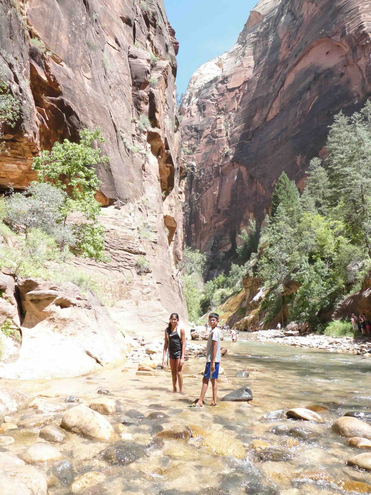
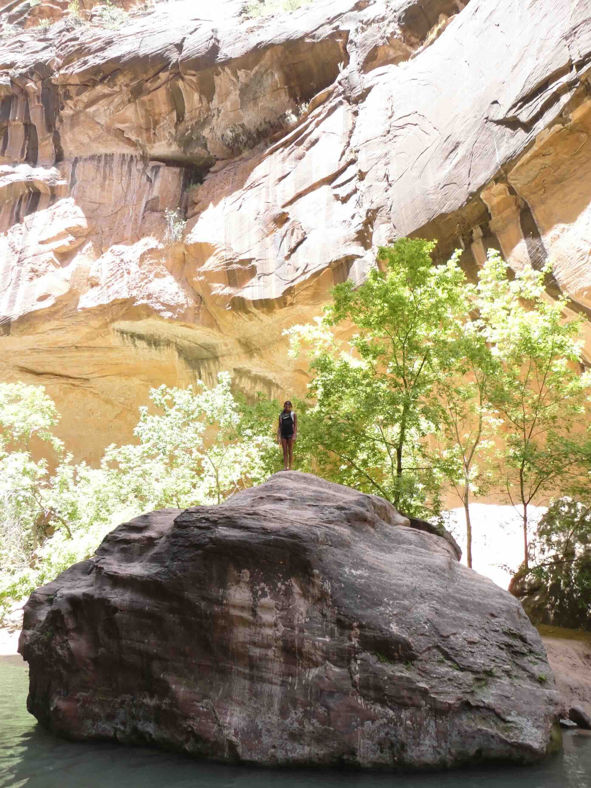
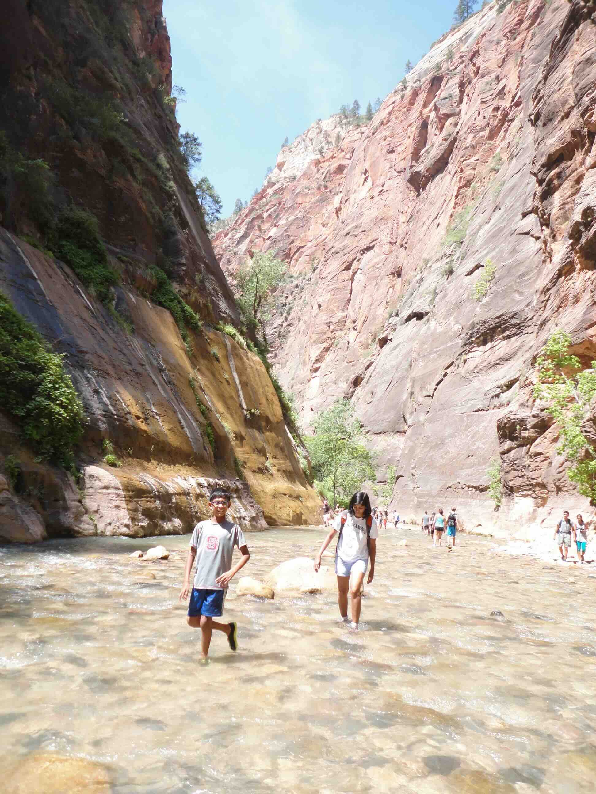
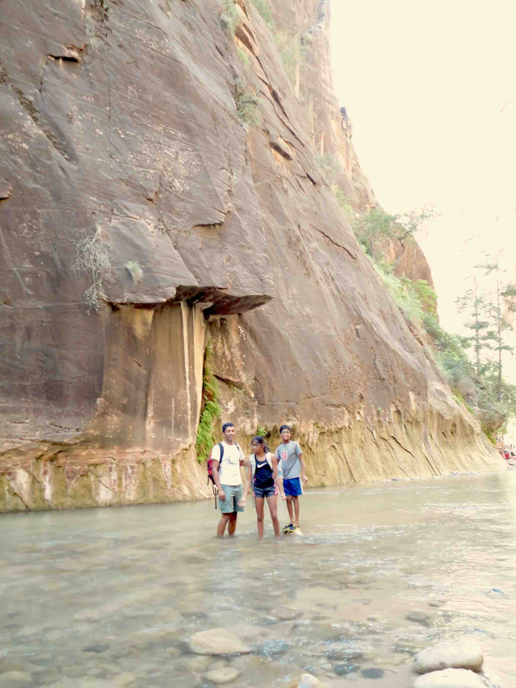

+++
date = '2015-07-01T12:00:00-04:00'
draft = false
title = 'Zion; The Narrows'
coords = [37.308503, -112.949034]
+++

### Zion; The Narrows Trail

* 2.1 mi
* 433' elevation gain
* 1.5 hours

### The Narrows in Zion National Park

### Rock in the Virgin River

### Hiking in Zion

[AllTrails - The Narrows](https://www.alltrails.com/trail/us/utah/the-zion-narrows-riverside-walk)
